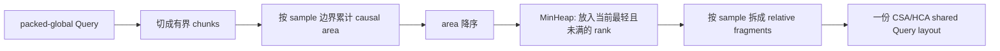
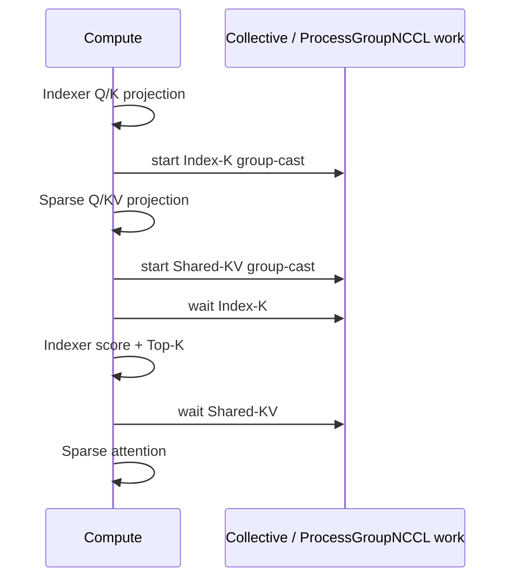
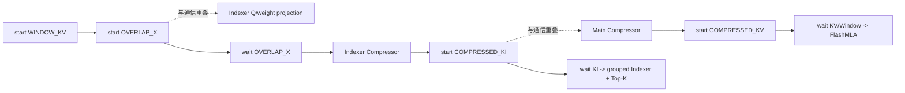
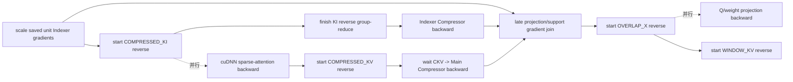
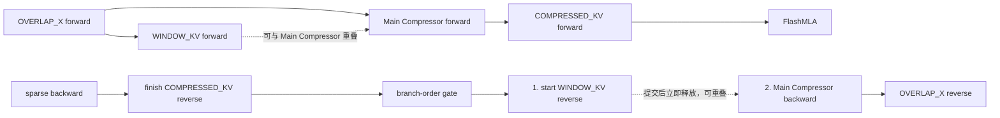

# DeepSeek-V4-Pro CP 负载均衡、K 路由与通信遮挡说明

> 状态：当前实现的解释性总览与性能证据，不是第三份权威设计。
>
> 架构、tensor/index ABI、collective、backward 和 backend 合同以
> [`magi_dsa_v4_design.md`](../../extensions/magi_attn_extensions/DSA/docs/design.md) 为准；结构性 cost 与 dispatch
> 以 [`README_dsv4_cp_dispatch_structural_balancing.md`](../../extensions/magi_attn_extensions/DSA/docs/structural_balancing.md)
> 为准。本文若与二者冲突，以这两份权威文档为准。
>
> 本文描述 clean revision
> `046f5c450719a79ddbf33f932e34d1632a85f361` 的当前状态。正式性能证据来自
> 8×B300、BF16、单条 128K、CP8、5-step Pro-pair profile。

## 1. 一句话结论

当前实现已经不是 sequential dispatch，也不是“local Q + full K AllGather”。

进入 61 层 Pro 主干前，`structural_balanced` 只执行一次：

1. 按 packed-global 坐标切 Query chunk；
2. 用 sample-relative native causal `AttnSlice.area` 作为 chunk cost；
3. 用 `MinHeapDispatchAlg` 把重 chunk 分散到不同 CP rank；
4. 生成一份 CSA/HCA 共用、与 ratio 无关的 Query layout；
5. 只对 pre-projection hidden `x` 执行一次 `TOKEN_LAYOUT` All2AllV。

此后 61 层内 Query owner 不再改变。30 个 CSA 层和 31 个 HCA 层只按各自
`ratio=4/128` 构建 local/remote K、window 和 compressor support route。

当前方案可以概括为：

```text
shared Query layout:
    native causal area + MinHeap

DSA 内的数据移动:
    required rows + typed All2AllV

反向通信语义:
    Core group-reduce back to the producer/source owner

一期 solver 目标:
    平衡计算 makespan

不冻结为 solver 先验:
    CSA-first / HCA-second
    忽略通信
    B300 专用经验权重

当前不采用:
    full-K AllGather
    nfunc mask
    doc padding
```

因此，对用户原始方案最重要的修改不是再发明一套 mask kernel，而是：

- 保留 structural cost + MinHeap 的 shared Query layout；
- 用 sample-relative fragment 和 explicit indices 表达可见域；
- 用 MSA 风格的 required-range 去重、`GroupCollectiveArg`、buffer layout 和
  launch/wait 分离实现通信；
- 针对实测暴露的 route 调度继续优化，而不是重新退回 sequential、ZigZag 或 AllGather。

## 2. 为什么 sequential dispatch 会失衡

### 2.1 Sequential 现在只是对比基线

Sequential 按 packed-global 顺序把 token 连续均分：

```text
packed input:
    [ sample 0 ][ sample 1 ][ sample 2 ] ...

sequential CP:
    rank 0 <- packed-global 第 0 段
    rank 1 <- packed-global 第 1 段
    ...
    rank P-1 <- packed-global 最后一段
```

对一个 sample，causal attention 的第 `s` 个前缀 token 能看到约 `s` 个 K。
如果一个 Query slice 覆盖 sample-relative 半开区间 `[u, v)`，其 native causal area 为：

```text
area([u, v)) = ((u + 1) + v) * (v - u) / 2
```

这里的 `u/v` 必须是 sample-relative 坐标。每遇到一个新 sample，cost 从头开始，
所以 packed varlen 的 cost 曲线是锯齿波，不是整条 packed sequence 上的一条斜坡。

对单条长序列，设每个 rank 连续取得 `L=T/P` 个 Query，第 `p` 个 rank 的理论
causal area 是：

```text
A_p = L * (((2*p + 1) * L) + 1) / 2
```

最慢 rank 与最快 rank 的 area 比为：

```text
A_(P-1) / A_0 = (((2*P - 1) * L) + 1) / (L + 1)
               -> 2*P - 1, when L is large
```

所以 CP8 的理论 causal area 比可接近 15 倍。这个数字只是 native causal-pair proxy
的 max/min 比，不是实际 DSA workload 的严格上界或 kernel 耗时承诺；tile、内存访问、
Top-K 饱和和 GPU 调度都会改变实际时间比例。

用户样稿里的 24K/192K 截图数字没有出现在当前正式 Pro artifact 中，不能作为本版本实测引用。
当前正式 artifact 只包含单条 128K 的 `structural_balanced` 结果。

### 2.2 CSA Indexer 是最敏感的部分

用 `s=sample_position+1` 表示当前 Query 的 causal prefix 长度。CSA Indexer 对每个
Query 扫描全部可见 compressed candidate：

```text
visible_indexer_entries(s) = floor(s / 4)
```

Top-K 只发生在 score 完成之后，不能让前面的全域 Indexer score 提前饱和。因此 sample
内越靠后的 Query 越重，这正是 sequential 把尾部 Query 集中到后面 rank 时最严重的问题。

### 2.3 CSA/HCA attention 也可能有残余差异

当前 Pro 的逻辑有效宽度可近似写成：

```text
CSA core width(s)
    = min(floor(s / 4), 1024) + min(s, 128)

HCA width(s)
    = floor(s / 128) + min(s, 128)
```

CSA core 在 compressed Top-K 达到 1024 后基本饱和，所以长 sample 上的位置差异小于
Indexer；HCA 的 compressed prefix 不饱和，但斜率只有原始 causal area 的约 1/128。

短 sample 候选数少于 1024 时，CSA 会选中全部可见 compressed row，但仍执行
explicit-index FlashMLA；它不会“退化成 dense varlen full-attention kernel”。
剩余 rank 差异可能来自有效 index 数、fragment/tile 分布、访存和 backward 热点，必须由
profile 区分，不能预设成某一种原因。

## 3. Dispatch 的目标和硬约束

### 3.1 当前一期目标

一期求解器使用：

```text
minimize max_rank(sum(chunk.native_causal_area))
```

通信是重要目标，但当前尚未写进 solver objective。现在的处理方式是完整记录每条 typed
route 的 rows、split、D2D、NCCL 时间和暴露时间，再根据真实 B300 证据决定是否校准 cost。
这叫“先用计算目标求解、同时测通信”，不叫“忽略通信”。

### 3.2 必须同时满足的结构约束

- 每个 Query token 精确覆盖一次，不能遗漏或重复；
- 每个 rank 的 chunk 数属于下面两个值之一：

```text
chunks_per_rank in {
    floor(num_chunks / cp_size),
    ceil(num_chunks / cp_size),
}
```

- 最后一个 chunk 可以更短，所以一般情形下只保证 token 数接近，不承诺绝对相等；
- CSA 与 HCA 的 `query_layout_hash`、Query token count 和 fragments 必须来自同一 layout；
- Query layout 进入 61 层前只生成和路由一次；
- 不 pad 输入 sample/doc；
- CSA aux loss 覆盖全部有效 Query；
- warm path 不运行 solver、object collective、host layout 构建或 device-map materialization。

等 chunk 数的作用是让 projection、MLP 接口等位置无关的 token 开销近似均衡，同时为
MinHeap 留出足够自由度。当前默认要求至少 16 chunks/rank。

## 4. 候选 dispatch 算法对比

| 方案 | 计算均衡 | 输入 padding | fragment/通信局部性 | 当前定位 |
| --- | --- | --- | --- | --- |
| Sequential | 单长 sample 与混合长度下容易严重失衡 | 无 | 连续、局部性好 | reference/shadow baseline |
| Global ZigZag | 单 sample 或等长周期下很好；混合长度时锯齿周期会错位 | 不必然需要 | 头尾打散 | 未采用 |
| 逐 doc ZigZag | 每个 doc 内可获得很强的理论平衡 | 常需补到 `2P` 倍数 | 每个 doc 被拆到大量 rank，fragment 多 | 未采用 |
| Native-area MinHeap | 对混合长度稳定，当前主目标直接优化 makespan | 无 token/doc padding | chunk 可能打散，通信不是理论最优 | 当前 production |

“每个 doc 都必须 pad 到 `2P`”和“每个 doc 一定分到所有 rank”只适用于逐 doc ZigZag，
不能泛化到 global ZigZag。

也不能声称 MinHeap 的通信量必然小于 ZigZag。MinHeap 优先解决计算 makespan，可能让同一个
sample 的深 fragment 分布在多个 rank，从而增加 required prefix 和本地 grouped-K 展开。

### 4.1 当前 MinHeap 配置

```text
DsaStructuralLayoutConfig(
    chunk_size=512,
    min_chunks_per_rank=16,
    uneven_shard=True,
)

resolved_chunk_size = min(
    512,
    ceil(total_tokens / (16 * cp_size)),
)
```

求解过程：

1. 按 packed-global 坐标切 chunk；
2. chunk 穿过 sample 边界时，分别计算各段 sample-relative causal area，再求和；
3. 按 area 从大到小排序；
4. 依次分配给当前累计 area 最小且 chunk 数未满的 rank；
5. assignment 完成后按 sample 边界拆成
   `DsaFragmentSpec(sample_id, q_begin, q_end)`；
6. 同 rank、同 sample 的相邻 fragment 可以合并，不连续 fragment继续保留。



当前一期没有采用：

- 新的 CSA/HCA 三分量经验权重；
- B300 专用 kernel-time 权重；
- CSA-first 或 HCA-first 求解顺序；
- 双目标向量 MinHeap；
- `BatchToppHeap`；
- `g>1` 的 superchunk/locality 旋钮。

### 4.2 为什么 native causal area 足够

三个主要位置相关分量都是 sample 内位置的单调函数：

```text
CSA Indexer area     ~= native_area / 4
HCA compressed area  ~= native_area / 128
CSA core              = compressed Top-K 饱和项 + window
```

等 chunk 数吸收了 window、projection 等近似与 token 数成正比的常数项；CSA core 的
Top-K 饱和又缩小了动态范围。权威 structural README 的 1M synthetic sweep 中，
native area 与完整三分量 cost 求得的 makespan 差距最大约 0.1%。

这不是说三个 kernel 的实际毫秒数完全同比，只说明它们在当前 dispatch 自由度下高度相关，
没有证据支持把硬件专用权重写进一期 planner。

## 5. Dispatch 后如何表达 causal 可见域

### 5.1 当前不是 local Q + full K

当前路径是：

```text
source hidden x
    -> TOKEN_LAYOUT All2AllV
    -> final local Query owner
    -> local Query + required local/remote K rows
    -> unique consumer bank
    -> backend-specific grouped metadata / explicit indices
```

DSA 内没有 full-K AllGather，也没有 Query worker、distributed Top-K 或 Top-K restore。

```mermaid
flowchart TB
    subgraph OLD["非当前路径"]
        OQ["local Q"] --> OK["full-K AllGather"]
        OK --> OM["一个大 causal/nfunc mask"]
    end

    subgraph NOW["当前路径"]
        X["source-owner x"] --> TL["TOKEN_LAYOUT All2AllV"]
        TL --> Q["final local Query fragments"]
        Q --> RR["required-row union"]
        RR --> A2A["typed All2AllV"]
        A2A --> BANK["unique consumer banks"]
        BANK --> META["grouped metadata / explicit INT32 indices"]
        META --> BE["official cuDNN + FlashMLA"]
    end
```



### 5.2 Indexer fragment metadata

每个 fragment 表示一个 sample 内的连续 Query 区间：

```text
fragment f = (sample_id, q_begin=a, q_end=b)
```

CSA Indexer 对该 fragment 需要的 compressed K prefix 是：

```text
required_prefix(f) = [sample_block_begin,
                      sample_block_begin + floor(b / 4))
```

同一 consumer rank、同一 sample 上有多个 fragment 时，网络侧只保留最长 prefix：

```text
required(consumer, sample)
    = max_f floor(f.q_end / 4)
```

Indexer 用以下 metadata 把全部 fragment组织成每 rank一次 grouped score 和一次 grouped Top-K：

```text
q_cu_seqlens      = prefix_sum(fragment.length)
k_cu_seqlens      = prefix_sum(floor(fragment.q_end / 4))
q_causal_offsets  = fragment.q_begin
```

这三项直接传给 cuDNN `indexer_forward_wrapper`，共同表达 grouped Indexer score 的 causal
mask。planner 还为下游 LSE、Top-K effective length 和 finalize 导出 per-Query
`indexer_seq_lens`。对 `f=[a,b)` 内局部行 `i`：

```text
indexer_seq_lens(f, i)
    = min(floor((a + i + 1) / 4), floor(b / 4))
    = floor((sample_position + 1) / 4)
```

`indexer_seq_lens` 与 score mask 的逻辑边界一致，但它不是
`indexer_forward_wrapper` 的 mask 输入。普通的一对递增 `cu_seqlens_q/k` 也不足以单独
表达不连续 fragment；score backend 还必须接收 `q_causal_offsets`。

### 5.3 Unique KI bank 与 grouped K pack

当前已采纳 MSA 的 consumer/sample required-prefix 去重，但官方 cuDNN grouped Indexer ABI
仍要求每个 grouped fragment 拥有连续 K segment。因此：

```text
local/remote KI rows
        |
        v
unique KI bank per consumer/sample       # 网络前缀只收一次
        |
        +--> prefix for fragment 0
        +--> prefix for fragment 1
        +--> prefix for fragment 2
                    |
                    v
             grouped contiguous K pack   # 本地物理展开
                    |
                    v
          one grouped Indexer invocation
```

Magi-MSA 可以用 `cu_seqlens_k + fragment_indices` 共享物理 prefix；当前固定 cuDNN ABI
没有等价的 prefix-reuse 输入，所以 DSA 只能在网络 bank 去重后执行一次可归因的
`k_pack`。不能通过只改 All2AllV 元数据假装这次本地展开已经消失。

### 5.4 Sparse attention 和 KL 不需要 nfunc

CSA FlashMLA 对每个 Query 使用固定 1152 个 INT32 槽位：

```text
[ 1024 compressed selected IDs | 128 exact raw-window IDs ]
```

两段各自用 `-1` 填无效项，不按 `topk_length` 压紧。window row 在构图时已经限制到
同 sample causal 区间：

```text
[max(0, position - 127), position]
```

HCA 也显式列出 exact window 与可见的 ratio-128 compressed prefix，并传实际有效长度。
selected KL 只在同一组 CSA compressed Top-K 上 recompute predictor/teacher。

未来位置 row 和 cross-sample row 根本不会进入 indices，所以当前不需要 nfunc、R2P 多区间比较，
也不依赖“CTA 不能跨 doc”。CTA 如何排任务是 backend 实现细节；correctness 已由 grouped
fragment metadata、per-Query indices 和 sentinel 与 CTA 边界解耦。

### 5.5 Padding 的准确边界

当前没有输入 token/doc padding：

- 不把每个 doc pad 到 16；
- 不把每个 doc pad 到 `2P`；
- 不为了 mask 修改 CTA 使其不跨 sample；
- 不把多个 sample flatten 成一个 nfunc 大 mask。

但“没有输入 padding”不等于所有 workspace 都没有对齐：

- Indexer score workspace 的 K width 向上对齐到 8；
- CSA attention 固定 1024+128 index 槽位，无效项为 `-1`；
- HCA index 外层宽度向上对齐到 128。

这些是 metadata/workspace padding，不会增加输入 token，也不会改变 sample length。

## 6. Compression block 边界与 `OVERLAP_X`

Compression block 始终按 sample-relative 坐标定义：

```text
CSA compression ratio = 4
HCA compression ratio = 128
```

一个长度为 `L` 的 sample 只生成完整 block：

```text
CSA rows = floor(L / 4)
HCA rows = floor(L / 128)
```

尾部不足一个完整 group 时不生成 compressed row。两种 Compressor 的 support 不完全相同。
CSA 第 `j` 行同时读取前一组 `B` 和当前组 `A`：

```text
B_j = tokens[4*j-4 : 4*j]     # j=0 时用零填充
A_j = tokens[4*j   : 4*j+4]
compressed_row[j] = Compressor(B_j, A_j)
```

HCA 第 `j` 行只读取当前完整 128-token group，不读取 CSA 式的 previous `B`。
shared Query layout 不保证 compressed row 的唯一 producer 同时持有该行所需的全部 support token，
因此：

1. planner 为每个 compressed row 指定唯一 producer；
2. producer 缺少的 hidden support 通过 `OVERLAP_X` All2AllV 获取；
3. forward 在 producer 上完成 sample-relative compressor；
4. backward 使用对偶的 Core group-reduce 把 `dX` 返回原 source owner。

默认 chunk 512 同时能被 4 和 128 整除，只是减少跨 chunk support 的性能优化，不是
correctness 前提。当前设计因此不需要靠 doc padding 修复 block 对齐。

## 7. 当前通信设计

### 7.1 外层 `TOKEN_LAYOUT`

```text
source-owner x[*, 7168]
    -> one TOKEN_LAYOUT All2AllV
    -> final Query owner
    -> local per-layer projections
    -> 61-layer Pro main trunk
```

backward 在模型侧汇合 `q/qr/latent_kv` projection 和 DSA activation gradient 后，
对 `dx_local` 执行一次 inverse `TOKEN_LAYOUT` All2AllV。

`TOKEN_LAYOUT` 不计入单个 CSA 的 `4F+4B` 或 HCA 的 `3F+3B`。正式 Pro-pair
capture 使用准备好的 post-projection leaves，并把 layout/projection 排除在 capture 外。

### 7.2 CSA/HCA typed routes

| Route | 每 row Pro BF16 payload | 作用 |
| --- | ---: | --- |
| `WINDOW_KV` | 512 BF16 | local Query 所需的 exact raw window KV |
| `OVERLAP_X` | 7168 BF16 | compressed row producer 缺失的 hidden support |
| `COMPRESSED_KI` | 128 BF16 | CSA Indexer 的 compressed K |
| `COMPRESSED_KV` | 512 BF16 | CSA/HCA main attention 的 compressed KV |

固定 communicator 发起顺序：

```text
CSA forward:
    WINDOW_KV -> OVERLAP_X -> COMPRESSED_KI -> COMPRESSED_KV

CSA backward:
    COMPRESSED_KI -> COMPRESSED_KV -> OVERLAP_X -> WINDOW_KV

HCA forward:
    OVERLAP_X -> WINDOW_KV -> COMPRESSED_KV

HCA backward:
    COMPRESSED_KV -> WINDOW_KV -> OVERLAP_X
```

每条 route 独立建图，拥有自己的 global-to-local map、unique receive、send pack 和
reverse group-reduce。当前 planner 为 CSA KI/KV 选择相同 compressed range plan，
但 ABI 不允许依赖它们相等，后续可以独立变化。

### 7.3 Group-cast / group-reduce 的准确含义

group-cast/group-reduce 现在就是 Core 的同名 primitive，不再只是一种语义描述：

```text
group-cast:
    owner ranges + consumer ranges
    -> Core group_cast（内部 A2AV，输出按全局行升序）
    -> consumer unique bank

group-reduce:
    consumer unique gradient
    -> Core group_reduce（同一个 GroupCollectiveArg 的对偶参数）
    -> producer/source owner gradient
```

DSA 不再自己拼 `all2all_v`，也不再自己写 pack 与 CSR。只有可微 backend pack 产生重复 row
时才需要 consumer-local coalesce；当前 grouped Indexer K pack 的 scorer 是 `no_grad`，
selected dKI 直接回到 unique KI bank，所以该 pack 没有 backward 归约。
`MAGI_ATTENTION_NATIVE_GRPCOLL=1` 仍不是目标，route 走 A2AV backend。

当前也已经没有 full-K AllGather，所以不能把“group-cast/group-reduce 替换 AllGather”
写成未来迁移；它已经是当前 typed-route 的语义。

### 7.4 Activation gradient 与权重梯度

DSA activation 的 `dKV/dKI/dX` 需要按上述 group-reduce 语义回到 producer/source owner。
这条 activation group-reduce 本身不会再引入参数 AllReduce；参数 replica reduction
是下面单独的一次模型侧操作。

Compressor、Indexer 和 sink 是模型侧 replicated 参数；各 rank 得到本地 partial gradient。
`MagiDSARuntimeMgr` 不拥有参数，也不注册 gradient hook 或归约 `dW`。在当前 Pro
CP-replicated 合同下，外层训练 reducer 必须且只聚合一次 FP32 main-grad；物理实现按
topology 使用 CP AllReduce 或 sharding-equivalent ReduceScatter。如果
Megatron/FSDP/ZeRO 已经覆盖同一 replica group，这就已经满足该合同，DSA 不能再重复归约。

## 8. 通信与计算 overlap

### 8.1 MSA 值得复用的是 planner 和 scheduled API

Magi-MSA 的关键不是换一个 collective 名字，而是把 route 分成 `start` 和 `wait`，在两者之间
填入依赖无关的计算：



backward 同样先发起可用的 reverse route，再做独立 backward，最后才 wait。DSA 已采纳：

- required-range 去重；
- consumer/sample 最长前缀；
- 复用 Core 的 `_calc_group_collective_arg_from_ranges` 做 route lowering；
- consumer bank 由 Core group-cast 直接给出全局行升序，两侧都不需要 permute；
- reverse 是同一个 `GroupCollectiveArg` 的 group-reduce；
- launch/wait 分离；stream 由 handle 持有，event/work/buffer/gate state 逐 invocation 私有；
- 参数不属于 runtime，通过 `DsaProjections` callback 由模型侧提供。

DSA 不能直接照搬的是 MSA 的 shared physical prefix ABI：固定 cuDNN grouped Indexer
仍要求 per-fragment contiguous K pack。

### 8.2 CSA 当前调度

CSA forward 的意图是：



CSA backward 的意图是：



四条 route 共享 communicator，彼此不并行；图中的并行只表示 route NCCL 与独立 compute
可以重叠。selected cuDNN Indexer backward 已在 forward 以 unit gradient 预计算；这里的
`Indexer Compressor backward` 是把 reverse KI gradient 传播回 `B/A` support 的独立分支，
不是再次运行 cuDNN selected Indexer backward。图中的 Indexer Compressor 分支与 CKV
reverse 没有数据依赖，这只是合法 overlap 窗口，不表示 CUPTI 已观察到交集。late join
同时等待两条 Compressor 的 `dPackedX` 和已缩放的 `dQIndexer/dWeights`。

### 8.3 HCA 当前调度

HCA 只有 Window route 与 Main Compressor 具有合法的 mode-local overlap 窗口：



以下四条是 dependency-bound：

- HCA forward `OVERLAP_X`：Main Compressor 的 support 前置依赖；
- HCA forward `COMPRESSED_KV`：Main Compressor 输出且 attention 前必须 ready；
- HCA backward `COMPRESSED_KV`：Main Compressor backward 的梯度前置依赖；
- HCA backward `OVERLAP_X`：消费 support gradient 的末端 route。

不能借 CSA 的 compute 遮挡 HCA route，也不能借 HCA 的 compute 遮挡 CSA route。
正式 profile 要求跨 mode compute overlap 精确为 0。

### 8.4 当前 8 卡 overlap 结果

覆盖率定义为：

```text
single-record overlap fraction =
    union(
        route NCCL interval
        intersect
        same rank/step/mode/direction non-route compute intervals
    )
    / route NCCL interval

mean coverage =
    arithmetic mean of 40 rank-step fractions
```

non-route compute 显式排除 NCCL、Core `range_gather`/`range_sum_reduce` 和 collective scope。
“未覆盖”只表示未被同 mode compute 覆盖的 route kernel 时间，不能直接等同端到端 GPU bubble。

| Route | 分类 | 正 overlap | 平均 route ms | 平均 overlap ms | 平均未覆盖 ms | 平均覆盖率 |
| --- | --- | ---: | ---: | ---: | ---: | ---: |
| CSA F `WINDOW_KV` | capable | 35/40 | 0.185639 | 0.136990 | 0.048649 | 74.16% |
| CSA F `OVERLAP_X` | capable | 31/40 | 0.384760 | 0.071974 | 0.312786 | 17.61% |
| CSA F `COMPRESSED_KI` | capable | 38/40 | 0.237702 | 0.174425 | 0.063277 | 86.77% |
| CSA F `COMPRESSED_KV` | capable | 35/40 | 0.279794 | 0.207986 | 0.071808 | 84.14% |
| CSA B `COMPRESSED_KI` | capable | 40/40 | 0.074348 | 0.068219 | 0.006129 | 91.13% |
| CSA B `COMPRESSED_KV` | capable | 0/40 | 0.491800 | 0.000000 | 0.491800 | 0.00% |
| CSA B `OVERLAP_X` | capable | 40/40 | 0.502872 | 0.499683 | 0.003190 | 99.36% |
| CSA B `WINDOW_KV` | capable | 40/40 | 0.111699 | 0.111699 | 0.000000 | 100.00% |
| HCA F `OVERLAP_X` | dependency | 40/40 | 0.333563 | 0.002414 | 0.331149 | 0.72% |
| HCA F `WINDOW_KV` | capable | 40/40 | 0.188614 | 0.153244 | 0.035370 | 94.57% |
| HCA F `COMPRESSED_KV` | dependency | 0/40 | 0.201688 | 0.000000 | 0.201688 | 0.00% |
| HCA B `COMPRESSED_KV` | dependency | 0/40 | 0.292096 | 0.000000 | 0.292096 | 0.00% |
| HCA B `WINDOW_KV` | capable | 40/40 | 0.093873 | 0.077543 | 0.016330 | 82.60% |
| HCA B `OVERLAP_X` | dependency | 0/40 | 0.330652 | 0.000000 | 0.330652 | 0.00% |

560 条 route 记录的次数、顺序、mode owner 和跨 mode 零 overlap 全部通过。400 条
`overlap_capable` 记录中 339 条有正 overlap；overlap 目前是 report-only，不设最低门槛。

最明确的可优化通信暴露是 CSA backward `COMPRESSED_KV`：它在 DAG 上可遮挡，但 40/40
全部暴露，平均未覆盖 0.4918 ms。其次是 CSA forward `OVERLAP_X`，平均未覆盖
0.3128 ms。两者相加约 0.805 ms 只是 route-kernel 暴露上界，不是可直接兑现的
端到端 latency 收益。

### 8.5 下一步 overlap 诊断与候选

当前代码已经表达“Window 后提交 OX”和“CKV reverse 尝试与 Indexer Compressor 分支重叠”
的调度意图，但正式 CUPTI 时间线分别只得到 17.61% 和 0% 平均覆盖率。所以下一步应先诊断
意图为什么没有在 GPU 时间线上兑现，再决定是否调整 stream/event/branch timing；不能把现有
意图重新画一遍就当成优化已经完成。

```mermaid
flowchart TB
    subgraph F["CSA forward: OX 低覆盖诊断"]
        F0["当前意图: Window launch -> OX launch -> Q/weight projection"]
        F0 --> FA["核对实际 kernel ready、host launch gap、event wait 与 step-0 偏差"]
        FA --> FC["有证据后再调整 stream/event timing"]
    end

    subgraph B["CSA backward: CKV 0-overlap 诊断"]
        B0["当前意图: dCKV ready -> CKV reverse，与 Indexer Compressor 分支重叠"]
        B0 --> BA["CUPTI 实测: 0/40 正 overlap"]
        BA --> BB["核对 CKI/CKV ready、分支时长、stream wait 与 branch timing"]
        BB --> BC["若独立 compute 不足，单改 launch/wait 也无法隐藏通信"]
    end

    subgraph ABI["backend candidate"]
        U["unique KI bank"] --> P["cuDNN prefix-reuse / fragment-indices 等价 ABI"]
        P --> N["删除或缩小 per-fragment K pack"]
    end
```



优化时仍必须保持四条 CSA reverse communicator 顺序：

```text
COMPRESSED_KI -> COMPRESSED_KV -> OVERLAP_X -> WINDOW_KV
```

不得用跨 mode overlap、host synchronize 或修改官方 cuDNN frontend 来制造更好看的时间线。

## 9. 为什么有 precompute 和 recompute

“precompute/recompute 多”实际上包含几类不同问题：

| 项目 | 目的 | 当前判断 |
| --- | --- | --- |
| cold plan、route/device map precompute | warm path 不跑 solver 和 host layout | 必须保留 |
| selected Indexer predictor recompute | 不保存完整 dense score matrix | 训练算法所需 |
| selected attention teacher recompute | 为 selected-KL 构造 compressed-prefix teacher | 训练算法所需 |
| selected-KL unit-gradient precompute | 保存之后按真实 `dKL` 缩放的三路 unit gradient | 当前合同，存在调度成本 |
| precomputed `dout/dkl` | profile 排除 scalar loss 和输入差异 | 仅测试，不是模型算法 |
| full attention recompute | 重新计算完整 sparse attention | 当前不支持，也不是目标 |

selected predictor/teacher recompute 的核心交换是：

```text
多做 O(T * TopK) 级 selected compute
    换
不保存 O(T * full-prefix) 的 dense score/teacher activation
```

它们不能因为名字叫 recompute 就直接删除。当前 trace 在 unit-gradient precompute 阶段观察到
每 rank/step 一次 cuDNN host API synchronization；这是 CSA forward tail/host-progress 成本，
不能恢复已撤销的 cuDNN frontend host-sync/default-stream 补丁来规避。

CSA backward `COMPRESSED_KV` 的 0-overlap 不是由这次同步直接造成。更根本的原因是大块
selected cuDNN Indexer backward 已经前移到 forward 做 unit-gradient precompute，真正 backward
只剩较小的 Indexer Compressor/projection 分支可用于遮挡 CKV。若要把 selected cuDNN
Indexer backward 移回真正 backward，那是训练算法与 autograd ABI 的独立重设计，必须重新审核
数值、显存和 natural backward，而不是简单移动一个 wait。

## 10. 当前正式结果

### 10.1 Workload 与 layout

```text
hardware:       8 x B300, SM103
dtype:          BF16
CP size:        8
input:          one causal sequence, 131072 tokens
steps:          5
forward order:  CSA -> HCA
backward order: HCA -> CSA
layout:         structural_balanced
chunk size:     512
```

结构性 layout：

| 指标 | Rank 0..7 |
| --- | --- |
| Query tokens | `[16384, 16384, 16384, 16384, 16384, 16384, 16384, 16384]` |
| Chunks | `[32, 32, 32, 32, 32, 32, 32, 32]` |
| Native causal area | `[1073750016 × 8]` |
| Fragment count | `[17, 32, 32, 32, 32, 32, 32, 16]` |
| Unique CSA Indexer-K rows | 31872–32768，relative range 2.7723% |
| Grouped physical packed-K rows | 264192–526336，约 1.992× |

因此本 workload 的 structural cost：

```text
E = max_rank(native_area) / mean_rank(native_area) = 1.000000
```

注意 grouped physical packed-K 的约 1.992× 差异是 cuDNN per-fragment K 展开的本地
packing 量，不是网络 unique-row 通信量。这正说明“主计算 cost 已平衡”与“fragment/pack
局部性仍有优化空间”可以同时成立。

### 10.2 Major kernel rank balance

`relative_rank_range` 定义为：

```text
(max_rank_time - min_rank_time) / mean_rank_time
```

下表取五步中最差的一步：

| Kernel group | Worst step | Min ms | Max ms | Relative range | 验收 |
| --- | ---: | ---: | ---: | ---: | --- |
| CSA Indexer score | 0 | 4.365786 | 4.488648 | 2.8005% | HARD，≤5% |
| CSA Indexer Top-K | 2 | 0.647110 | 0.663623 | 2.5279% | HARD，≤5% |
| CSA FlashMLA forward | 3 | 3.577583 | 3.636160 | 1.6228% | report-only |
| CSA selected Indexer backward（forward unit-gradient precompute） | 1 | 3.015707 | 3.116991 | 3.3067% | report-only |
| CSA sparse-attention backward | 1 | 19.877455 | 20.991916 | 5.5126% | report-only |
| HCA FlashMLA forward | 1 | 2.153788 | 2.243286 | 4.0900% | report-only |
| HCA sparse-attention backward | 1 | 10.540413 | 11.138668 | 5.5422% | report-only |

只有 Indexer score/Top-K 承担 5% 硬门槛，10 个 step/group 全部通过。两个 sparse
backward 单步略高于 5% 是 report-only 观测，不能写成 release fail，也不能写成“全部 kernel
都低于 5%”。

### 10.3 Collective、归因与 correctness

- 每 rank/step 的 CSA 为 `4F+4B`；
- 每 rank/step 的 HCA 为 `3F+3B`；
- Pro-pair 总账精确为 `7F+7B`；
- kernel attribution coverage 为 1.0；
- memcpy attribution coverage 为 1.0；
- 五个 Indexer/selected-KL 审计 scope 内的 CUPTI CUDA D2D memcpy 总计为
  0 copies、0 bytes、0 ms，`outside_known_scope` 同样为 0；
- 跨 mode compute overlap 最大值为 0；
- CP1、installed-wheel CP2、installed-wheel CP8 natural correctness 全部 PASS；
- release finalizer 为 PASS。

### 10.4 Artifact

原始 profile：

```text
artifacts/profile/
  20260806T105058Z-dsv4-pro-128k-pro-pair-structural-balanced-precomputed-dout/
```

关键文件：

```text
balanced/balanced_5steps_pro_pair.nsys-rep
balanced/balanced_5steps_pro_pair.sqlite
MAJOR_KERNEL_BALANCE_PRO_PAIR.json
PRO_PAIR_COMMUNICATION_OVERLAP.json
INDEXER_D2D_PRO_PAIR.json
REPORT_PRO_PAIR.md
```

封存 release：

```text
artifacts/release/
  20260806T105939Z-dsa-v4-release-resumed/
```

Provenance：

```text
source revision:
    046f5c450719a79ddbf33f932e34d1632a85f361

installed-wheel image:
    sha256:bfb012e9ae4215f06a4c96f6e95ab112c7a1c88f8b9f94b1c13a628ee384133b
```

## 11. 现在是否应该修改负载均衡设计

结论是：**不应该推翻当前 structural layout；应该在它上面继续改通信与本地 packing。**

理由：

1. native causal area 对 CSA Indexer、CSA core 和 HCA 的结构 cost 已有理论相关性；
2. 当前 128K CP8 layout 的 native area 达到 `E=1.0`；
3. 唯一承担 5% 门槛的 Indexer score/Top-K 最差分别为 2.8005% 和 2.5279%；
4. CSA/HCA 已经共享一份 Query layout，无逐层重排；
5. natural CP1/CP2/CP8 forward/backward 与 release profile 都已通过。

当前最合理的优先级是：

1. 先定位 CSA backward `COMPRESSED_KV` 的既有 overlap 意图为什么没有在 CUPTI 时间线兑现，
   再评审 stream/event/branch timing；若独立 compute 不足，不能承诺只改 launch/wait 就能隐藏；
2. 诊断 CSA forward `OVERLAP_X` 的低覆盖来自 kernel-ready、host launch gap、event wait
   还是 step-0 偏差，再决定是否调整与 Indexer Q/weight projection 的调度；
3. 保持 MSA 式 required-prefix/`GroupCollectiveArg`/buffer layout，继续压缩 source pack、
   bank assembly 和 route wait；
4. 推动 cuDNN grouped Indexer 支持与 `fragment_indices` 等价的 physical-prefix reuse，
   降低 grouped K pack 放大；
5. 在多种 packed/ragged、长短混合 workload 上采集 route critical-path 数据；
6. 只有当通信或 forward+backward 实测 makespan 持续偏离 native area 时，才评审
   `g>1` locality、通信 cost 或硬件校准权重。

当前不能得出的结论：

- MinHeap 通信量必然小于 ZigZag；
- sparse attention 会自动达到绝对均衡；
- 本次 DSA-core Pro-pair 等价于完整 61 层 Transformer 端到端收益；
- route 未覆盖时间可以直接相加成 wall-clock 提速；
- CSA-first/HCA-second、忽略通信或 B300 权重应该成为 solver 先验；
- 需要用 nfunc、doc pad-to-16 或 CTA 不跨 doc 才能保证 correctness。

## 12. 用户样稿到当前版本的对应修改

| 用户样稿内容 | 当前文档中的处理 |
| --- | --- |
| “当前是 Ulysses sequential dispatch” | 改成 historical/reference baseline；production 已是 `structural_balanced` |
| 24K/192K 截图数字 | 不作为当前证据；正式 artifact 只有 128K balanced |
| 短 doc 不足 Top-K 退化 full attention | 改成 effective selected width；仍是 explicit-index FlashMLA |
| ZigZag | 保留比较，但区分 global 与逐 doc ZigZag |
| Min-heap LPT | 改成当前 `AttnSlice.area + MinHeapDispatchAlg` 的精确配置 |
| `BatchToppHeap` | 仅作为未采用候选，不写成当前功能 |
| local Q + full-K AllGather | 替换为 required-row typed All2AllV |
| 只靠 `cu_seqlens_q/k` bottom-right mask | score 改用 grouped q/k cu-seqlens + q causal offset；per-Query length 服务 LSE/Top-K |
| nfunc/R2P | 当前无需，不进入 production ABI |
| doc pad 到 16 | 删除；使用 sample-relative compression block + `OVERLAP_X` |
| CTA 不跨 doc | 删除；correctness 与 CTA 边界解耦 |
| AG/RS 暴露分析 | 替换成当前 `4F+4B / 3F+3B` route trace |
| group-cast/group-reduce 替换 AllGather | 已经是当前实现，直接调用 Core group_cast/group_reduce |
| “通信先放低优先级” | 改成“不进入一期 objective，但必须完整测量与归因” |

最终判断：第一份 structural balancing README 的 cost/dispatch 方向足以作为当前一期方案，
当前版本也已经按这个方向落地，并在冻结的单条 128K、CP8 Pro-pair workload 上通过 8 卡证据。
这还不是 packed/ragged、混合长度分布的完整实测证明；后者仍需补 profile。就现有证据而言，
主要缺口不在“重新选择 Query dispatch 算法”，而在 CSA reverse CKV 的调度、CSA forward OX
的遮挡，以及 cuDNN grouped K physical-prefix reuse。
