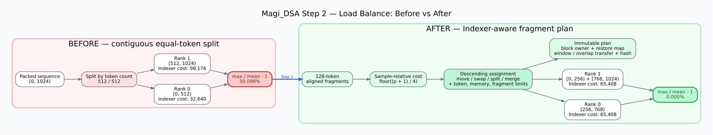
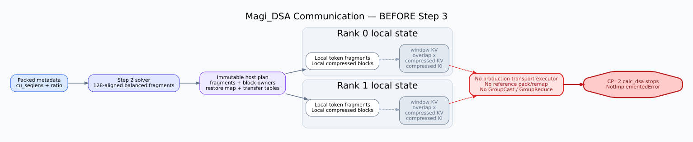
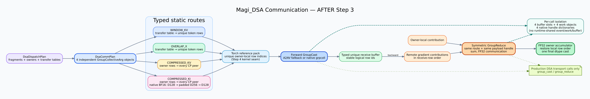

# Magi_DSA V4 设计文档

本文与仓库根目录 `PLAN.md` 共同冻结 Magi_DSA V4 的实现口径；发生冲突时以 `PLAN.md` 的“冻结合同”为准。当前验收平台仅为 SM90/H100 80GB：CP=1 使用 1 卡，CP=2 使用同机 2 卡。

## 可复现基线

- MagiAttention 基线：`529fb0a4e273b3557a56d8afd60b74da46688095`。
- DSA 计算原型：`98e043cafebbdcbce6835e26849d96624136ef70`。
- Megatron dsv4 数值参考：`c6449f0b23be397449f21c0967c5fc90785e55ea`。
- DeepSeek 官方 HF 配置：`deepseek-ai/DeepSeek-V4-Flash@60d8d70770c6776ff598c94bb586a859a38244f1`；使用该 revision 的 `config.json` 和 `inference/config.json`。
- FlashMLA nv_dev：`b7643bd54521f563b839b98289b5cd048c062ba2`。
- NVIDIA cudnn-frontend：`f00538322e9d3d439fe8c5f3144644e58ee66823`（安装包 `nvidia-cudnn-frontend==1.27.0`）。
- fast-hadamard-transform：`e7706faf8d1c3b9f241e36860640ad1dac644ede`。
- CUTLASS 子仓：`81a43e6d92cdd8c20d22392f9579604ed5f710a1`；FA4 子仓：`ee1d15159cda6f3f97bfab9e487da146a8254970`；`nvidia-cutlass-dsl==4.5.2`。
- 开发镜像：`magi-dsa-dev:v2`，本机 image id `sha256:9c51e29d1fda8fc1a6e2a8e16c7b0773309e91dcbd44cf6d0182e5e3327c1029`；其 v1 基础层为 `sha256:000b7bb606e306ca31050615e2896a5becc1eda2ede3e8c4ab4f76113969479d`。NGC PyTorch 26.05 固定为 registry digest `sha256:222d8b18e671be5c3ef91cb41727a2572a0b23f59ded6c39f373a96946f6f2ba`（build `313520559`，build ref `30a5fc6cbfce157e75fae3d0cf1fd8e273a3dc25`）。

`agents/docker/magi-dsa-dev/Dockerfile` 和 `magi-dsa-flashmla/Dockerfile` 分别固定 cudnn-frontend、fast-hadamard-transform 和 FlashMLA commit。镜像 tag 只作为易读别名，测试报告同时记录 image id。

## 数值与模块边界

- compressor 输入 hidden `x`，不是投影后的 latent KV。内容投影和门控投影都从 `hidden_size` 出发。
- Indexer 的 Qi、Ki、Weights 由 runtime 内部从 `qr` 和 `x` 投影生成；Indexer 分支 detach 输入，KL 不向 trunk `x/qr` 回传。
- cuDNN sparse backward 原生返回 `d_sink`。sink 等价于 value 为零的附加 softmax 条目，但正式实现不通过补算代替原生梯度。
- Q/KV 最后 64 维已经由模型侧做 partial RoPE。压缩条按 logical block id 使用压缩 RoPE；官方配置使用 `compress_rope_theta=160000`、YaRN factor 16、original max positions 65536。
- 压缩器只处理完整块，sample 尾部不足 ratio 的 token 不生成压缩条。ratio=4 使用重叠 compressor，ratio=128 使用非重叠 compressor。
- 位置 `p`（sample 内 0-based）只能看到 `floor((p+1)/ratio)` 个完整压缩块。
- Indexer score 为 `sum_h weights[q,h] * relu(Qi[q,h] dot Ki[k])`。top-k 按 score 降序、同分按小 logical block id；合法项在前，其余填 `-1`。
- KL target 来自主 Q 与 compressed KV 的逐头注意力分布；predict 来自 Indexer。CP 下可微返回值为 `local_kl_sum / global_query_tokens`。

## 公共 API 与 tensor schema

正式入口位于：

```text
magi_attention/api/dsa_attn_interface.py
magi_attention/dsa_runtime_mgr.py
magi_attention/functional/dist_dsa.py
```

`experimental/dsa_v4` 保留为已验证的计算/kernel 原型，公共调用方不再直接调用 `forward_cp` 或 `forward_cp_packed`。

- `DsaPackedMeta` 保存 packed sample 边界 `cu_seqlens`（1-D contiguous int32、首项 0、单调不减）。
- `MagiDSAInput` 具名保存 `x`、`qr`、`q`、`latent_kv`、FP32 `sink` 和 `packed_meta`。
- 行张量均为 packed THD：`x [T,hidden_size]`、`qr [T,q_lora_rank]`、`q [T,64,512]`、`latent_kv [T,512]`、`sink [64]`。
- `calc_dsa(input, runtime_mgr)` 返回 `O [T,64,512]` 与可微 FP32 标量 `kl_loss`。
- 一个 `MagiDSARuntimeMgr` 只服务其 config 固定的一种 ratio，并持有 compressor/Indexer 参数。CP=1 计算路径继续复用 `MagiDSAV4.forward_packed`；步骤 2 按 packed layout/policy 缓存真实 fragment plan。步骤 3 已提供独立的 CP=2 transport 层；`calc_dsa` 的完整 CP=2 attention 编排仍在步骤 5/6 接入。
- ratio=0 不构建 compressor/Indexer；ratio=128 只构建 compressor；ratio=4 同时构建 compressor 和 Indexer。

V1 固定配置为：Hq=64、Hkv=1、D=512、rope dim=64、window=128、Hidx=64、Didx=128、topk=512，主路径 BF16，sink FP32。`hidden_size`、`q_lora_rank` 和 `softmax_scale` 由模型配置提供。

## Kernel 接入边界

- sparse forward 复用 FlashMLA `flash_mla_sparse_fwd`。
- sparse backward/d_sink、Indexer forward/top-k、score recompute 和 Indexer backward 复用 cudnn-frontend `cudnn.deepseek_sparse_attention`。
- 统一 wrapper 位于 `experimental/dsa_v4/kernels.py`；步骤 1 只接线，不重写、不 fork 外部 kernel。
- reference backend 只用于数值对拍；正式 kernel backend 的输入为 CUDA BF16，top-k 保持 device resident。
- 唯一计划内新增的计算辅助 kernel 是 `kernel/cutedsl/dsa_pack.py`，用于 packing、remap 与 FP32 CSR reduction。步骤 4 只在 SM90/H100 验收，但 public frontend、device mapping schema 和带 arch 的编译 cache key 不绑定 SM90；kernel 只使用 SM90/SM100 共有的通用 global copy、寄存器 FP32 累加和 128-bit vector copy。

## CP plan 与通信

- dispatch/transfer plan 以 sample-relative logical positions 和可非连续 fragments 表示；128 对齐只约束可切分边界，不假设 fragment owner 相邻。
- compressed KV、compressed Ki、window KV、compressor overlap x 是四种独立 typed payload，分别持有 metadata、buffer slot 和 work handle。
- compressed KV/Ki 静态发送到全部 CP peers；window KV 和 overlap x 按 sample/fragment transfer table 只发送 unique rows。
- 正式数据交换只通过 `group_cast` / `group_reduce`。DSA 生产代码不直接调用 torch P2P、all-gather、all-reduce 或 `all2all_v` 替代。
- backward 使用 forward 的对称 GroupReduce；窗口与压缩条落到同一原 token 的梯度先用 FP32 accumulator 合并。
- collective 进入顺序在全部 rank 一致；空路线仍传合法零长度 metadata。

步骤 2 已建立不可变的 host plan：`DsaFragmentSpec` 使用 sample-relative
坐标；完整 plan 显式保存每 rank fragments、compressed block owner、分段
restore map，以及 window KV / compressor overlap x 的 unique-row transfer
table。sequential baseline 按 128 对齐连续切分；balanced solver 先最小化
ratio=4 最慢 rank 的 Indexer scan cost，再在允许 slack 内按 token、通信、
fragment overhead 和显存预测选择完整 E2E 最小的候选。rank 0 确定性求解后
广播 plan，runtime 按 packed layout 与 policy 缓存。

步骤 3 在 `functional/dsa_comm.py` 中实现了通信层。`DsaCommPlan` 为四类
payload 各自生成一个 `GroupCollectiveArg`：window KV 与 overlap x 根据
transfer table 将相同 owner row 的 destination 合并后只 pack 一次；
compressed KV/Ki 则把 owner-local compressed block 静态发送给所有 peer。
每条 source/destination 空路线也保留显式零长度 split，因此所有 rank 能按
固定顺序进入 collective。

步骤 4 保留 torch `index_select`/`index_copy_` reference map 仅用于测试对拍；
production forward 使用静态 device-resident int32 destination→source map 和 CuTe
DSL row-copy kernel 打包 owner-local unique rows，再调用 `group_cast` 得到带稳定
logical row id 的 typed receive buffer。backward 复用同一元数据和 payload-private
native handle 调用对称 `group_reduce`，GroupReduce 初始 owner rows 也由 row-copy
kernel 提取；返回结果按 inverse CSR map 以固定顺序、无 atomic 写回 owner-local
FP32 accumulator，最后只做一次目标 dtype 转换。device map 可作为静态 plan state
共享，send/receive buffer、work 和 native handle 仍按调用独占。

`dsa_pack.py` 同时提供 logical block/token id→packed-local row 的 int32 remap LUT；
`-1` sentinel 和 unavailable logical id 保持 `-1`，动态 Indexer top-k 全程留在
device。CSR kernel 支持重复 source、空 destination row、极端 fan-in，以及覆盖
非空 row或累加到已有 FP32 accumulator两种模式，为步骤 5/6 的 KV bank
packing 和多路径梯度合并提供固定接口。

native grpcoll 的 BF16 transport row 要求 256-element 对齐；compressed Ki 的
逻辑宽度固定为 128，因此仅在 native send/receive buffer 内部右侧补零到 256，
接收后立即裁回 128。A2AV、logical row id 和对外 tensor schema 均不改变；反向
FP32 的 128-element row 已满足该 dtype 的 native 对齐要求。

`DsaCommBufferSlot`、`DsaGroupCastWork`、`DsaGroupReduceWork` 和 native handle
dictionary 都按单次调用、单 payload 创建，不进入 runtime 共享静态对象。生产
DSA 通信源码只调用 `group_cast` / `group_reduce`；A2AV 是该 primitive 的内建
fallback，不在 DSA 层直接调用。



步骤 3 修改前：



步骤 3 修改后：



## Saved-state 与并发

- forward 只保存 O、FP32 LSE、`topk_idx`、`topk_length` 和 compressor gate 反向必需中间量。
- 不保存 compressed、remote/packed tensor、work 或 CUDA event；backward 按静态 plan 重收输入并重算压缩条，不重算 top-k 或 sparse forward。
- work、event、remote buffer 和 saved-state 都属于单次 autograd 调用，不放入 runtime 共享静态状态。
- d_sink 与 runtime replicated 参数梯度由 DSA 内部 GroupReduce，并标记为 CP-reduced，外层不得对同一 CP group 重复归约。

## 正式测试与当前命令

正式测试固定在 `tests/test_dsa`。步骤 1 提供公共 API 的配置/字段拒绝测试，以及 CP=1 三种 ratio、packed、sink、compressor、KL、输出和梯度与原型 API 的对拍。

当前 H100 镜像命令：

```bash
# 公共 API（步骤 1）
docker run --rm --gpus all --ipc=host \
  -v /home/scratch.wewen_gpu:/ws -w /ws/MagiAttention/agents/worktrees/magi-dsa-v4-plan-grpcoll \
  magi-dsa-dev:v2 timeout 300 pytest -q tests/test_dsa/test_dsa_api.py

# 步骤 2 host fragment/solver plan（不需要 GPU）
docker run --rm \
  -v /home/scratch.wewen_gpu:/ws -w /ws/MagiAttention/agents/worktrees/magi-dsa-v4-plan-grpcoll \
  magi-dsa-dev:v2 timeout 300 pytest -q \
  tests/test_dsa/test_dsa_dispatch.py tests/test_dsa/test_dsa_solver.py

# 步骤 3 CP=2 transport-only（双 H100，60 秒 watchdog）
docker run --rm --gpus all --ipc=host \
  --ulimit memlock=-1 --ulimit stack=67108864 \
  -v /home/scratch.wewen_gpu:/ws -w /ws/MagiAttention/agents/worktrees/magi-dsa-v4-plan-grpcoll \
  magi-dsa-dev:v2 timeout 60 pytest -q tests/test_dsa/test_dsa_cp.py

# 步骤 3 native grpcoll 完整出口（已编译扩展的本地验证镜像）
docker run --rm --gpus all --ipc=host \
  --ulimit memlock=-1 --ulimit stack=67108864 \
  -w /tmp/native-test magi-dsa-native-step3:final \
  timeout 60 pytest -q test_dsa_cp.py

# 已有 DSA 原型回归
docker run --rm --gpus all --ipc=host \
  -v /home/scratch.wewen_gpu:/ws -w /ws/MagiAttention/agents/worktrees/magi-dsa-v4-plan-grpcoll \
  magi-dsa-dev:v2 timeout 300 pytest -q tests/test_attn/test_dsa_v4.py
```

编译后的单 kernel 测试使用 30 秒 watchdog，CP 通信测试使用 60 秒 watchdog；kernel 单次执行超过 10 秒按死锁处理。探索脚本和原始日志保留在 `agents/tests/magi-dsa-v4`，不替代正式测试。

## grpcoll 探针保存

原型 worktree `agents/worktrees/magi-dsa-v4` 的未提交 grpcoll 探针没有被覆盖或 reset；完整可应用补丁保存在 `agents/backups/magi-dsa-v4-grpcoll-probe-20260709.patch`，SHA256 为 `b6a6b8fadb48a38dc2c9b38bb1abd1fab8d5d86f27fedb67d298bded836416ee`。
