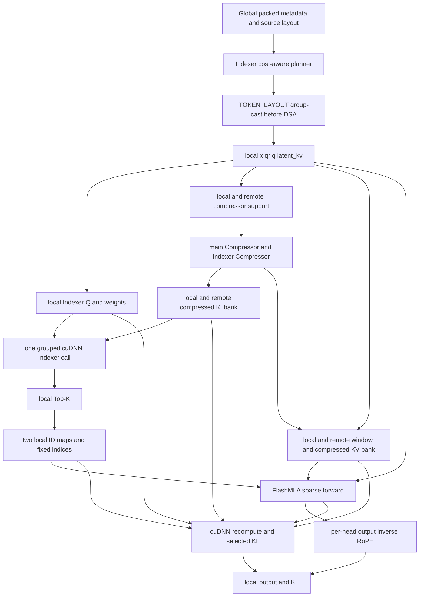
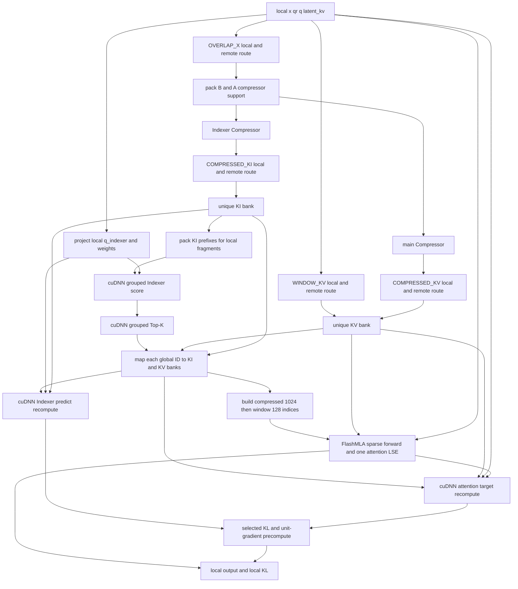
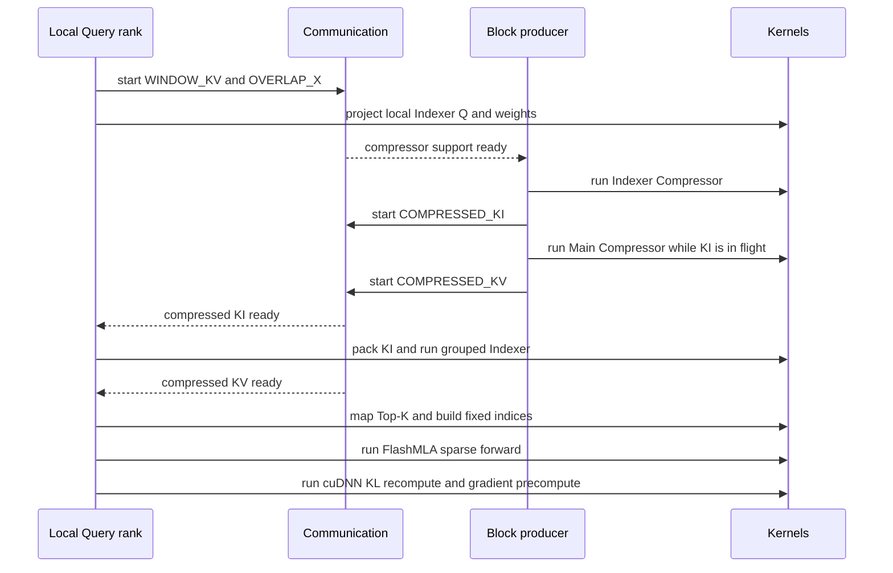
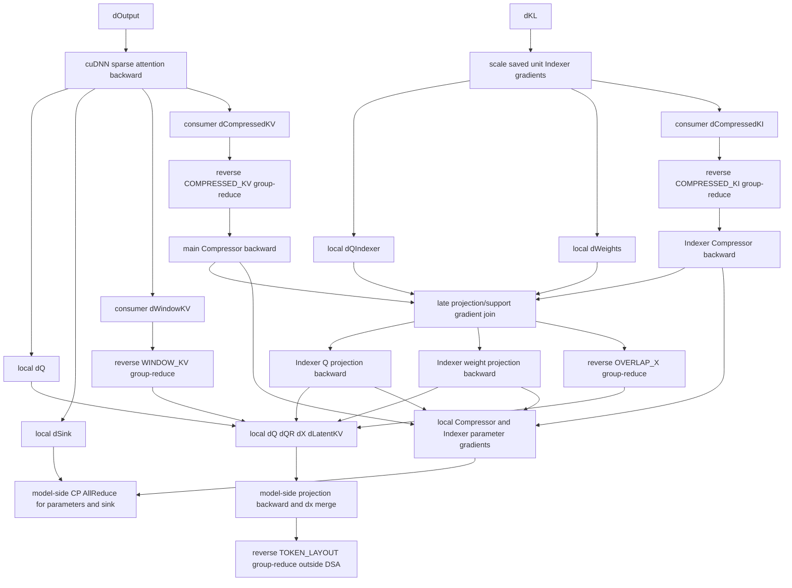

# Magi-DSA v4：DeepSeek-V4-Pro 结构负载均衡与 local/remote K 设计

> 状态：当前权威设计，实现与验收中。
>
> 更新：2026-08-09（Core 复用重构：route 改为 range 加 Core group-collective、
> plan 去掉逐行索引表与 object collective、参数移出到模型侧 callback、
> policy 收敛到 `structural_balanced` 一种、`ratio=0` 与 CuTe pack kernel 删除）。
>
> 上一版：2026-08-06（DeepSeek-V4-Pro 61 层、`structural_balanced`、官方
> FlashMLA Pro ABI 与代表性 CSA+HCA profile 合同）。
>
> 范围：官方
> `DeepSeek-V4-Pro@b5968e9190ef611bbf34a7229255be88a0e937c1` 主干 61 层：
> 31 个 HCA（`ratio=128`）与 30 个 CSA（`ratio=4`），BF16 causal
> packed/varlen training。主干不含 window-only 层，`ratio=0` 已从 `DsaRatio`、
> planner、runtime 和测试中删除；独立 MTP 的 window-only 语义只在
> `DSV4_PRO_MTP_COMPRESS_RATIO` 里作为出处记录保留。

2026-08-09 的重构把下列能力交还给 MagiAttention Core，DSA 侧不再有对应实现：

- route 的 split、rank route 与稳定 output 顺序，来自
  `DynamicAttnSolver._calc_group_collective_arg_from_ranges`；
- 通信本身，来自 Core 的 `group_cast` 与对偶的 `group_reduce`；
- 行 gather 与区间归约，来自 Core `range_gather` / `range_reduce` 与 `index_select`；
- chunk 分配与 chunk×sample 拆分，来自 native dispatch meta 与 `AttnBucket`。

随之删除的有：`kernels/cutedsl/pack.py` 及其 AOT manifest 与 prewarm 脚本、
`packing.py` 的六份逐行索引表、`solver.py` 的 `_build_route` 与大部分 route 校验、
`DsaGroupCollectiveArg` 与 `DsaTypedRoutePlan` 两层中间结构。

2026-08-06 以前本文中的 Flash-Base `4096/1024/64/512`、compressed Top-K 512
以及 `shared_greedy` 记录，只能作为历史实现/profile 审计证据。它们不得覆盖本文
当前 Pro 尺寸、`structural_balanced` 共享 Query layout、官方 backend ABI 和
代表性 Pro-pair 验收合同。

## 1. 一句话结论

负载均衡在 **进入 61 层 Pro 主干前**完成。`structural_balanced` 将
packed-global Query 切成有界 chunk，以 Magi 原生 causal `AttnSlice.area` 作为一期 cost，
由 `MinHeapDispatchAlg` 得到一份 ratio-independent 共享 Query layout。61 层均使用该
layout；CSA 和 HCA 只按各自数学构建 ratio-specific K route。一期不写入 B300 经验
权重，也不把 CSA-first/HCA-second 或“忽略通信”冻结为架构；后续只能根据
B300 真实 kernel、route 与 D2D profile 证据校准 cost。

进入 DSA 后 Query 一直留在 local rank，DSA 只获取 local Query 所需的 remote
KI/KV，并在 local Query 上完成 Indexer、官方 FlashMLA sparse attention 和官方 cuDNN
DSA/selected-KL。每个 CSA 层的 aux loss 覆盖该层全部有效 Query，保留
Indexer→`qr/x` 的梯度链。KL 的 selected teacher/recompute、clipping、loss scale
与单位梯度调度参考固定 Megatron revision；attention/predictor 归一化域采用本文 6.1
节的裁决，production 不依赖 Megatron fused autograd function。

本设计明确不采用：

- replicated global `x/qr`；
- DSA 内部的 Query worker 或 `INDEXER_QW` 路由；
- Query 广播、distributed Top-K 或 Top-K 回传 owner；
- activation AllGather；
- Megatron `FusedIndexerSparseAttnFromTopkFunc` runtime 依赖。

## 2. 系统边界和张量

### 2.0 Pro 主干层序与精度边界

官方 Pro 主干使用 layer id `0..60`，固定层序为：

```text
HCA: 0, 1, 3, 5, ..., 59       # 31 layers, ratio=128
CSA: 2, 4, 6, ..., 60          # 30 layers, ratio=4
```

61 层分别拥有自己的 Compressor/Indexer/attention 参数，不允许用两份代表性权重
冒充完整模型参数支持。正式 Pro-pair profile 只是 DSA-core 性能代表性验收，
不声称执行了具有层间 activation 依赖的 61 层 Transformer。

当前 attention 训练 ABI 固定为 BF16 activation、activation gradient 与线性权重，tensor-core
GEMM/归约使用 FP32 accumulator，score/LSE/sink/APE/RMSNorm scale/rope frequency 显式保留
FP32，ID 为 INT32。BF16 参数的本地 `.grad` 不由 DSA runtime 改写；外层训练框架负责将其累积到
FP32 main-grad，并按实际 replica/sharding topology 执行一次必要的 AllReduce 或 ReduceScatter。
若 Megatron/FSDP/ZeRO 已覆盖该 CP replica group，不允许 DSA 再做一次重复参数归约。官方推理
checkpoint 的 FP8/FP4 量化存储不会被隐式扩展成训练 backward 合同。

### 2.1 DSA 入口

调用 DSA 时，上游已经完成一次 layout assignment 和 All2AllV。每个 rank 只持有最终
local fragments 对应的张量：

| 张量 | 形状 | 含义 |
| --- | --- | --- |
| `x` | `[Tlocal, 7168]` BF16 | local hidden states |
| `qr` | `[Tlocal, 1536]` BF16 | `q_layernorm(q_down(x))` |
| `q` | `[Tlocal, 128, 512]` BF16 | main attention Query |
| `latent_kv` | `[Tlocal, 512]` BF16 | raw window KV |
| `sink` | `[128]` FP32 | attention sink parameter |

`TOKEN_LAYOUT` 只物理发送 projection 前的 hidden state `x`；`qr/q/latent_kv` 在最终 Query
rank 上由 routed `x` 生成。表中的五项是 DSA 调用边界，而不是五个 layout collective payload。

Indexer 的数学合同为：

```text
q_indexer     = Hadamard(RoPE(linear_wq_b(qr), sample_position))
compressed_ki = Hadamard(IndexerCompressor(B, A))
score_weights = linear_weights_proj(x) / sqrt(64)

score(q, k) = sum_h(
    relu(dot(q_indexer[q, h], compressed_ki[k]) / sqrt(128))
    * score_weights[q, h]
)
```

`qr` 是一个 tensor，不是 `q` 和 `r` 两个张量。Q/K 两侧都执行 Hadamard；Q 的 RoPE 使用
fragment 对应的 sample-relative position。模型侧 weights projection 使用 BF16 权重与输入、FP32
accumulator，并在单个 epilogue 中以 FP32 load 乘 `1/sqrt(64)` 后写回 BF16；`1/sqrt(128)` 是独立的
Indexer dot-product scale。grouped score
和 sparse Indexer backward 必须对未乘 `1/sqrt(128)` 的 `score_weights` 传相同的 cuDNN
`sm_scale=1/sqrt(128)`。固定 selected-recompute wrapper 没有 `sm_scale` 参数，因此只在该调用入口利用
`relu(c*x)=c*relu(x)`，临时将 `1/sqrt(128)` 乘入 recompute weights 并 cast 回 BF16；该临时张量不得
传给 sparse Indexer backward。三条路径不允许重复或遗漏任一 scale，模型侧/backend 的拆分也是
梯度 ABI 的一部分。
官方 Pro 的其余冻结尺寸是 `head_dim=512`、`rope_dim=64`、
`indexer_heads=64`、`indexer_head_dim=128`、`indexer_topk=1024`、`window_size=128`、
`norm_eps=1e-6`。

官方 attention 输出还有一条不能由 backend wrapper 省略的坐标合同。FlashMLA/cuDNN 返回的
原始 `O_rot [Tlocal, 128, 512]` 在每个 head 的末 64 维仍位于 RoPE 旋转坐标系；交给
grouped output projection 前必须执行：

```text
O_model[..., :448] = O_rot[..., :448]
O_model[..., 448:512] = RoPE^-1(
    O_rot[..., 448:512],
    sample_relative_query_position,
    layer_yarn_frequencies,
)
```

`layer_yarn_frequencies` 与本层 Q/K 使用同一组非持久 FP32 frequency buffer，ratio 4/128
共用该语义。这个 inverse RoPE 必须 out-of-place，不得改写 sparse-attention backward 保存的
`O_rot`；其 backward 是相反方向的正向 RoPE，LSE、Top-K 和 selected-KL 状态都不随输出旋转。

### 2.2 DSA 内只区分 local 和 remote

前置 `TOKEN_LAYOUT` 完成后，当前 rank 上的 Query 就是 local Query，DSA 内不再移动它。
对 Query 需要的 KI/KV：

- 本 rank 生成的是 local K；
- 其他 rank 生成、通过 group-cast 取回的是 remote K。

实现上不需要四张 ownership 表。cold plan 只需下列信息：

```text
local_fragments   # 本 rank 的 Query 区间，由上游 layout 给定
block_producer    # 每个 compressed block 由哪个 rank 生成
typed_routes      # WINDOW / OVERLAP_X / COMPRESSED_KI / COMPRESSED_KV 的收发行
```

需要哪些 K 的 rank 已经体现在 `typed_routes` 中，不再单独保存 consumer 表；前置重排
前的 token 在哪个 rank 也由 `TOKEN_LAYOUT` 管理，不是 DSA forward 的元数据。

## 3. 总体框架



## 4. DSA 前的 Pro 共享结构负载均衡

### 4.1 一期 cost：原生 causal area + MinHeap

`structural_balanced` 是唯一的 layout policy，`sequential`、`indexer_balanced` 和
`shared_greedy` 已从代码里删除，只在 4.5 节保留历史记录。

planner 不用 CSA 或 HCA 的专用经验权重，也不自己切 chunk。它把 packed sample 交给
native `make_dispatch_meta_from_qk_ranges` 加 `MinHeapDispatchAlg` 做 chunk 分配，再从
native `make_bucket_per_rank_from_qk_ranges` 拿回每个 rank 的 `AttnBucket`，直接把
`AttnSlice` 改写成 sample-relative fragment。chunk 与 sample 的求交、causal area 的计算
都在 Core 里，DSA 不再重算一遍。一个 causal self-attention slice 的 K 一定从 sample
起点开始，所以 sample 原点直接从 `k_range.start` 读出：

```text
chunk_cost = sum(
    causal_area(chunk intersect sample)
    for sample in packed_samples
)

causal_area([u, v)) = (u + 1 + v) * (v - u) / 2
```

`MinHeapDispatchAlg` 以该整数 area 分配 chunk，并保证每个 rank 获得
`floor(num_chunks/cp_size)` 或 `ceil(num_chunks/cp_size)` 个 chunk。默认配置是：

```text
DsaStructuralLayoutConfig(
    chunk_size=512,
    min_chunks_per_rank=16,
    uneven_shard=True,
)

resolved_chunk_size = min(
    configured_chunk_size,
    ceil(total_tokens / (min_chunks_per_rank * cp_size)),
)
```

该 objective 与 ratio 无关，因而 CSA/HCA 必须得到完全相同的
`query_layout_hash`、`query_token_counts` 和 fragments。这是一期冻结算法，不是宣称
通信、Indexer tile、Top-K 或 compressor 都无成本。plan 同时记录 native area、Query
tokens、fragments、typed-route rows 和 Indexer `unique/packed/duplicate` K rows；这些指标
在一期中只作诊断，待 B300 Pro-pair profile 显示稳定瓶颈后再作为可评审的
cost 校准候选。

### 4.2 packed-global chunk 与 sample-relative fragment

assignment atom 是上述 packed-global chunk，不是旧 Indexer-only planner 的 128-token
sample band。chunk 分配完成后再按 sample 边界拆成：

```text
DsaFragmentSpec(sample_id, q_begin, q_end)
```

规则为：

- 每个非空 sample 的 `[0, sample_length)` 必须 exact cover；
- 不能重复、不能留洞；
- packed-global chunk 可以穿过 sample 边界，拆分后的 fragment 坐标必须重置为
  sample-relative；
- chunk 无需为 CSA `ratio=4` 或 HCA `ratio=128` 扩大成 correctness 对齐合同；
  跨边界 compressor support 由 sample-relative block 和 `OVERLAP_X` 处理；
- sample 尾部可以小于 compression ratio，不足一个完整 group 时不生成 compressed row；
- 一个 rank 可以持有多个不连续 fragments，进入 DSA 时按 local order 拼接。

`structural_balanced` 必须把最终 layout 的 resolved chunk size/count、每 rank chunk
IDs/native area/Query count/fragment count 和 layout hash 写入 immutable cold plan。warm path
禁止再运行 solver、构建 host layout、做 object collective 或隐式扩容。

### 4.3 当前 CSA 的 `m=4` Compression block 边界

每个 sample 只为完整 4-token group 生成 compressed row：

```text
block_count = floor(sample_length / 4)
```

CSA 的第 `j` 条 compressed row 读取：

```text
B = tokens[4*j-4 : 4*j]     # j=0 时为零填充
A = tokens[4*j   : 4*j+4]
compressed_row[j] = Compressor(B, A)
```

默认保留当前 block owner 规则：当前 `A` 组最后一个 token 的 Query owner 生成该
compressed row。即使 fragment 对齐 4，第一个 local block 的 `B` 仍可能是 remote，所以
`OVERLAP_X` 不能删除。

HCA 按 sample-relative 的完整 128-token group 生成 compressed row，每行只读取当前
group，producer 同样是 group 末 token 的 Query owner。共享 Query layout 不保证该
producer 本地持有 group 的全部 source rows，因此 HCA 仍需 `OVERLAP_X`；但它不读取
CSA 式的 previous `B` group。

### 4.4 前置 layout All2AllV

planner 输出一个全局双射 `TOKEN_LAYOUT` route：每个 source token 只发送到一个最终
Query owner。目标物理边界固定为：

```text
source-owner x
    -> TOKEN_LAYOUT All2AllV(x)
    -> final-Query-owner x
    -> local q_down/q_up/kv_down/RoPE
    -> local qr/q/latent_kv
    -> enter DSA
```

因此基础合同中 forward 只有一次物理 layout All2AllV，payload 是 BF16 hidden state
`x [Tsource, 7168]`；backward 在模型侧 projection 梯度汇合为 `dx_local` 后执行一次逆向 layout
All2AllV。route mapping 可以被多个张量复用，但每次调用 collective 都要单独计数；“同一 route”
绝不等于“一次物理 All2AllV”。若某个 adapter 选择在 projection 后分别路由 `qr/q/latent_kv`，那是
另一种待评审 ABI，不能记作本设计的一次 layout collective。

这是 All2AllV，不是 AllGather。如果 route 由 autograd function 包装，其 backward 也是一次逆向
All2AllV。这条 route 属于 DSA 输入边界，不计入下文“DSA 内部 collective”数量。

### 4.5 历史：2026-08-03 Base `shared_greedy` 实验

> 本节只是历史记录。`shared_greedy` 的实现、`DsaSharedLayoutConfig`、B300 proxy 权重、
> 128-token band 和 local improvement 循环都已从代码中删除，`--local-improvement-passes`
> 入口也一并删除。下面的描述仅用于解释 `artifacts/profile/20260803T*` 那几份产物是怎么
> 得到的，不得作为当前合同，也不能据此重新引入第二个 policy。

`shared_greedy` 实现 `README_cp_dispatch_balancing.md` 的唯一选型“确定性贪心 + 4 轮局部改善上限
（无改善时提前收敛）”，并冻结以下
实验合同：

- `DsaSharedLayoutConfig` 必须显式给出 `ki_memory_budget_bytes`、
  `ki_workspace_reserve_bytes` 和有界 `local_improvement_passes`；reserve 必须非负且严格小于 budget；
- 每个 sample 默认切成 128-token band，按独立 CSA Indexer cost 从重到轻确定性放置；候选依次按
  全局最大 Indexer cost、最大 KI modeled bytes、fragment 总数、目标 rank Indexer cost 和 rank id
  比较；
- 完整解按 `(I,H,R,F)` 严格词典序优化。局部改善只检查瓶颈 rank 的单 band move 和每个目标 rank
  最多 4 个近似等重 band swap；默认最多 4 个 improvement step；
- v1 Indexer 整数代理为 `8*S + K + 32*U`；HCA 整数代理为
  `256*Q_H + 2048*(send_rows+recv_rows) + 4096*max_peer_rows`；模型版本固定为
  `b300_sm103_structural_proxy_v1`，tick 不得解释为 GPU ns；
- KI modeled bytes 精确包含 BF16 grouped-K、`DsaDeviceIndexerMap` 中随 layout 变化的 int32 map，
  再加显式 workspace reserve。其逐项公式与版本说明见
  `README_cp_dispatch_balancing.md` §4.3；grouped Indexer selection 是 `no_grad`，不计算不存在的
  grouped-K backward gradient；
- W/CSA/HCA 必须分别构建 ratio-specific compression block 和 typed route；三份 plan 的
  `query_layout_hash`、`query_token_counts` 和 layout metrics 必须逐项相同。三种 ratio 都在 DSA
  外执行 `TOKEN_LAYOUT` forward/reverse，DSA 内 collective 顺序和数量保持各自原合同；
- cold solver 结果允许按完整输入/config 做有界进程内缓存；warm execution handle 仍不得运行 solver、
  object collective 或 host layout 构建；
- plan 必须记录 solver/cost-model 版本、候选评估数、实际 improvement step、停止原因、最终 key、
  逐 rank cost/显存/fragment 和 Query layout hash。构造失败只能报告 search
  failure，不能声称已证明 infeasible。

冻结 128K 实验入口使用 1 GiB KI budget、256 MiB workspace reserve 和 4 个 improvement step。
CP8 natural correctness 与正式 B300 attention-suite 对比 Profile 已于 2026-08-03 通过；证据和
裁决见 §8.5 及 `README_cp_dispatch_balancing.md` §8。该 policy 仍保持 opt-in：当前 capture 排除
`TOKEN_LAYOUT`，HCA forward 虽明显更均衡但绝对时间上升，最终 run 的首 step CSA Indexer score
也存在超过 5% 的离群。在端到端边界开销和绝对时间 non-regression 门槛通过独立评审前，
它不能替换当时 Base release 默认的 `sequential/indexer_balanced`。

2026-08-03 的补充消融把 8 张 B300 graphics clock 锁定为 1800 MHz，并在 `nsys start` 后、正式
五步外运行一个等价 attention-suite warmup；passes=0/1/4/8 各运行一次，passes=4 重复三次。六个
run 的输入、参数、seed、镜像和逐 rank config identity 全等，全部通过 natural shadow、8F+8B、
attribution coverage=1.0、锁频/恢复和 artifact manifest 审计。4→8 轮使 cold-solver 微基准从
24.577 秒增至 45.971 秒，最大 Indexer proxy 只改善 0.0294%；passes=8 的 HCA sparse-forward
steady rank range 为 0.78%，落在三次 passes=4 的 0.69%--0.81% 内，完整 HCA forward 的残差由
NCCL/到达时序主导。因此该历史 `shared_greedy` 的算法选型当时固定为 4 轮，
0 轮只用于低冷启动诊断，8 轮不采用。完整结构
负载与消融表分别见讨论稿 §8.3 和 §8.7，汇总产物为：

```text
artifacts/profile/20260803T054958Z-dsv4-shared-greedy-dispatch-ablation/
```

该消融当时不改变 Base release profile 默认行为。`--local-improvement-passes`、
`--profiler-attach-warmup-steps` 和 `--lock-gpu-clock-mhz` 只允许用于 shared-greedy attention-suite
诊断；默认仍为 4/0/unlocked。attach warmup 必须有独立 NVTX 和 runtime-counter delta，不能进入正式
training-step 记录；锁频必须逐卡记录锁定前/锁定后/恢复后状态，任一 GPU 不能精确锁定或不能恢复都使
run 失败。

同日的一次性 KI 显存排序消融只从 greedy key 删除 `max_rank_modeled_ki_bytes`。该 plan 仍满足
correctness，但 modeled KI max 增加 3.174 MiB、rank relative range 从 0.773% 增至 1.615%，cold
candidates/time 增加 15.38%/19.42%，且五步 DSA-core+gradient-AR 无收益。因此该历史
`shared_greedy` solver 固定保留
显存第二排序项；实验入口已删除，只保留原始证据：

```text
artifacts/profile/20260803T094307Z-dsv4-flash-128k-attention-suite-shared-greedy-passes4-kimemhardonly-clock1800-attachwarm1-precomputed-dout/
```

简要解释见 `README_cp_dispatch_balancing.md` §8.8。该消融当时不改变 Base release
默认行为，也不影响当前 Pro 合同。

## 5. Forward

### 5.1 详细数据流



具体步骤：

1. local `x/qr` 直接生成 `q_indexer/weights`，没有 Query route。
2. `WINDOW_KV` 获取每个 local Query 需要的 raw window union。
3. `OVERLAP_X` 获取本 rank 生成 compressed rows 所需的 unique `B/A` support。
4. main Compressor 和 Indexer Compressor 各生成一份 local compressed rows。
5. `COMPRESSED_KI` 和 `COMPRESSED_KV` 分别获取 local Query fragments 的 causal-visible prefix union；
   CSA 在同一 communicator 上严格先发起 KI，再发起 KV。
6. 接收端将 unique KI 展开成 grouped varlen prefixes，每 rank 只调用一次 cuDNN score 和一次
   cuDNN Top-K。
7. Top-K 从产生开始就是 Query-owner local order，不做 collective。
8. 同一个 logical compressed ID 分别映射到 KI bank 和 KV bank 的 consumer-local row；两种 bank
   不要求相同物理行序，但两次映射都必须保持原 Top-K 列顺序。
9. 构造固定宽度 `flash_indices [Tlocal, 1152]`：前 1024 列是 selected compressed-KV，后 128
   列是 window-KV；各区域内部无效项填 `-1`，不能按有效长度压紧。
10. 直接调用以 924 为基线并依次应用 dual-LSE 与 Pro-H128/prefix-1024 两份
    官方已审核增量的 FlashMLA，同一次 kernel invocation 产生 output、完整
    `sparse_lse` 和仅覆盖前 1024 个 compressed 项的 `compressed_lse`。完整
    `sparse_lse` 只保存给 sparse backward，`compressed_lse` 只供 KL attention teacher。
11. grouped Indexer score 仍产生 raw full-domain score、Top-K 和诊断用 `indexer_lse`。cuDNN 使用
    KI/KV 两套 local indices 重算 selected-only predictor/teacher，并用 sparse
    `indexer_backward_wrapper` 预计算单位 `dKL` 的 selected-only Indexer 梯度；未选 candidate 梯度为 0。

固定 index ABI 为：

```text
kv_bank = concat(window_kv, compressed_kv)

ki_indices = ki_global_to_local[topk_global_ids]
kv_indices = kv_global_to_local[topk_global_ids]

flash_indices[:, 0:1024]    = Nwindow + kv_indices
flash_indices[:, 1024:1152] = window_rows

FlashMLA arguments:
    topk_length = None
    indexer_topk = 1024
```

早期 Query 的有效 compressed Top-K 小于 1024 时，仍在前 1024 列的尾部填 `-1`，window
固定从第 1024 列开始。`topk_length` 保留为诊断和正确性结果，但不传给这次
FlashMLA 调用。

### 5.2 KI/KV 路由集合

对一个 local fragment `(sample_id, q_begin, q_end)`，Indexer 需要的 compressed-KI 范围是：

```text
[sample_block_begin, sample_block_begin + floor(q_end / 4))
```

一个 rank 可能持有多个 fragments。planner 先对所有 prefix 求并集，使一条物理 KI/KV row
对该 consumer 最多通信一次；重复 prefix 在接收端本地 pack。这与 Magi-MSA 的
unique receive + prefix pack 语义一致。

`COMPRESSED_KI` 与 `COMPRESSED_KV` route 分别独立求 union 和 consumer-local row order。planner
只需保证每个可被 Top-K 选中的 logical compressed block 在两种 bank 中都可映射；不要求：

```text
compressed_ki.consumer_rows == compressed_kv.consumer_rows
```

两套 map 从同一 `topk_global_ids` 按列 gather，确保 KL 的 predict/target 列语义一致。

V1 在 Top-K 前静态获取 causal-visible compressed-KV prefix。Top-K 减少 sparse attention 计算，
但不减少 V1 的 compressed-KV 网络量。selected-KV dynamic routing 不在本设计范围内。

#### 5.2.1 consumer 物理行序与 D2D 边界

route 不再自己排 receive row。四条 route 现在只声明 owner ranges 和 consumer ranges，
交给 Core 的 `_calc_group_collective_arg_from_ranges` 求交、切 split、算 rank route。
group-cast 返回的 consumer bank 天然按全局行升序排列，所以 forward 之后没有 consumer
unpermute，backward 之前也没有 inverse pack，这两步不是被优化掉的，而是根本不存在。

由此消失的还有整套逐行索引表。以前每条 route 要存 `send_source_rows`、
`received_global_rows`、`consumer_global_rows`、`consumer_from_received`、
`received_from_consumer`、`reverse_source_rows` 六份，host 侧是 Python int tuple，
device 侧是常驻 int32 tensor，规模是 O(行数 × cp_size)。现在只存 range，规模是
O(range 数)，128K/CP8 下每 rank 十几个 range。

在当前官方 backend ABI 下，以下 D2D 仍然存在：CSA compression-support gather、
KV bank assembly/cat，以及把 unique KI bank 展开成 cuDNN grouped Indexer 连续
fragment-prefix 的一次 grouped K pack。最后一项是 cuDNN 当前没有 Magi-MSA
`fragment_indices` prefix-reuse ABI 造成的必要 forward copy；Indexer scorer/Top-K 是
`no_grad`，所以不存在对应 grouped-K backward reduce。support gather 用
`index_select`，它的 backward 自带 scatter-add，所以 CSA overlap 的重复行不需要另写
CSR。prefix gather 是 Core `range_gather`。后续是否 fusion 必须以 8.0 节
D2D/route/kernel 分账证据为准，不允许用隐藏 copy NVTX 的方式声称已消除。

per-query 的 window 和 compressed 索引也不再常驻。两者在各自 consumer bank 里都是连续
run，因此只存一个 base 和一个 length；`[Tlocal, 128]` 的 window 表和 HCA 那张
`[Tlocal, max_visible]` 的 compressed 表都已删除，后者在 128K/CP8 下原本是每个 handle
六十多 MB。

### 5.3 Forward collective 对账

| 顺序 | DSA 内部 route | payload width | 作用 |
| ---: | --- | ---: | --- |
| 1 | `WINDOW_KV` | 512 BF16 | 获取 remote raw window rows |
| 2 | `OVERLAP_X` | 7168 BF16 | 获取 remote compressor support |
| 3 | `COMPRESSED_KI` | 128 BF16 | 获取 remote Indexer K |
| 4 | `COMPRESSED_KV` | 512 BF16 | 获取 remote compressed attention KV |

ratio=4 的当前 DSA forward 为 4 次 group-cast。合同中：

- 删除 `INDEXER_QW [8256]`；
- 删除 `Top-K auxiliary [516]` 逆向；
- 没有 AllGather；
- 没有 object collective。cold plan 是 caller metadata 的纯函数，每个 rank 各自算出
  同一份，既不 `all_gather_object` 收集 owner layout，也不 `broadcast_object_list`
  广播 plan。

这里的 group-cast 是 Core 的 `magi_attention.comm.primitive.grpcoll.group_cast`，底层
仍是 A2AV，但 split、rank route 和稳定 output 顺序由 Core 负责，DSA 不再自己拼
`all2all_v`。反向是同一个 `GroupCollectiveArg` 的 `group_reduce`，两者严格对偶。

前置 `TOKEN_LAYOUT` 单独记账，不能隐藏在 DSA forward 的 4 次中。

### 5.4 推荐 overlap



当前实现复用 MSA 的生命周期模式，并把 route 拆成 launch 与 wait 两步：`start` 以
`async_op=True` 发起 Core group-cast 并持有每次调用私有的 output buffer 和 work，
`finish` 在 caller stream 等待并把梯度边接回 producer；backward 是同一个
`GroupCollectiveArg` 的 group-reduce。consumer permutation 与 owner CSR 都由 Core 承担，
DSA 侧没有对应代码。该结构不在
execution handle 中复用 activation buffer，已覆盖 two-inflight、retain-graph、reentrant backward 和
gradient accumulation。这里的 two-inflight 指同一 host 线程按所有 rank 完全相同的 invocation 顺序
提交多张 graph；同一 handle 不支持多个 host 线程无序并发注册 collective。若后续需要该能力，必须
增加 invocation slot 与跨 rank communicator sequence gate，不能只复用当前共享 stream bundle。

用户于 2026-07-22 批准 route 异步化，于 2026-07-23 批准提前 KI，并于 2026-07-24 批准将剩余
CSA reverse 尽可能由计算遮挡。每个 CSA execution handle 冷路径创建四条非 default CUDA stream：
sparse-attention backward、Main Compressor、Indexer projection 和 support route；event、route work、
send/output buffer 仍为逐 invocation 私有状态。

`dist_dsa` 的 communicator 提交顺序仍固定为
`WINDOW_KV → OVERLAP_X → COMPRESSED_KI → COMPRESSED_KV`。Window/OX 在 support-route stream
提交，local Indexer Q/weights 在 Indexer stream 投影；caller 只通过 CUDA event 等待 OX consumer
数据，不做 host synchronize。`OVERLAP_X` ready 后先执行 Indexer Compressor 并立即 start
`COMPRESSED_KI`；Main Compressor 与 `COMPRESSED_KV` 在 Main stream 提交，因此 KI 可由 Main
Compressor 遮挡，CKV 可继续与 grouped Indexer 计算重叠。跨 stream 输入和输出必须同时使用 event
表达 producer→consumer 依赖，并使用 `record_stream` 保护 allocator 生命周期。

backward 新增一个不改变数值的 multi-output autograd late join：它同时等待
`dQIndexer/dWeights` 和两条 Compressor 对 `dPackedX` 的梯度，再一次释放 projection 与
compression-support 两侧梯度。随后 Q/weight projection backward 在 Indexer stream 入队，
local support scatter-add 与 `OVERLAP_X` reverse 在 caller/support-route stream 入队；同一 projection
计算窗口继续覆盖 `WINDOW_KV` reverse。另一个 CSA branch-order autograd gate 持有提前就绪的
Window consumer gradient，直到 compression-support 分支产生 `dOverlapX`；该 gate 在同一
support-route stream 上显式先 start `OVERLAP_X` reverse、再 start `WINDOW_KV` reverse，并把两个
owner-local gradient 重新接回原始 `x/latent_kv`。因此 Window 最后提交是代码因果关系，不依赖
PyTorch ReadyQueue 的内部顺序。四条 reverse 的 communicator 提交顺序固定为
`COMPRESSED_KI → COMPRESSED_KV → OVERLAP_X → WINDOW_KV`，不同 stream 只改变独立计算的
提交位置，不允许跨 rank 改变 collective 顺序。

“顺序正确”由 collective-order 测试冻结；“确实存在 GPU overlap”必须由正式 128K NSYS 用 CUDA
runtime correlation 和 CUPTI kernel timeline 证明，不能只根据 work 同时存活或 CPU NVTX 相交宣称
通过。CSA-only forward+backward 汇总必须对四条 reverse 的每个 rank/step 验证其
`ncclDevKernel_SendRecv` 与非 route GPU compute 有正交集，并记录通信时长、重叠时长和覆盖比例；
当前不冻结最低覆盖比例。

## 6. FlashMLA、cuDNN KL 与 Backward

### 6.1 直接 kernel 组合，不依赖 Megatron fused autograd

production 不调用 Megatron `FusedIndexerSparseAttnFromTopkFunc`。Magi 自己编排固定版本的
FlashMLA/cuDNN kernel，Megatron 只作为 selected teacher、clipping、缩放和预计算调度的参考；
teacher/predictor 归一化域与固定 Megatron sparse-loss 路径一致。Magi 仍保留 KI/KV 两套独立
consumer-local row map，不引入 Megatron fused autograd runtime 依赖。

CSA FlashMLA forward 的目标 ABI 为：

```text
output, max_logits, sparse_lse, compressed_lse = flash_mla_sparse_fwd(
    q,
    kv_bank,
    flash_indices,
    softmax_scale,
    attn_sink=sink,
    topk_length=None,
    indexer_topk=1024,
)
```

依赖以 `FlashMLA@9241ae3ef9bac614dd25e45e507e089f888280e0` 为基础 revision，并按
固定顺序应用两份官方增量：

1. `13d173ac48abd8ec88a4e742bcaaa59c5ccf4ece` 的 15 文件 dual-LSE 增量，
   补丁 SHA-256 为
   `6957dbde516c73066c5911108761325edc1bdcd8f62e15dc0a84f4f290118d4b`；
2. `b7643bd54521f563b839b98289b5cd048c062ba2` 的 Pro
   H128/`INDEXER_TOPK=1024` small-topk LSE 增量，补丁 SHA-256 为
   `c534e13ff432ac1c694cb24981826c11be26a2d9743d7175ddb05f887279461f`。

两份增量不新增第二次 attention pass；同一个 FlashMLA sparse-forward kernel 在
H128/D512/total-topk-1152 组合下同时保存 full 与 prefix running LSE。
`topk_length=None` 时 kernel 按每列 sentinel 判断有效性，因此固定
`[compressed:1024, window:128]` 两段内部存在 `-1` 空洞仍是合法输入。

ABI 按 ratio 严格分派：

- CSA `ratio=4` 必须传 `indexer_topk=1024` 并严格接收四输出；
- HCA `ratio=128` 不传 `indexer_topk`，继续传实际 `topk_length` 并严格接收三输出；
- 不允许在四输出缺失时退回完整 LSE teacher，也不允许根据返回 tuple 长度静默 fallback。

三个 LSE 状态的职责为：

- `sparse_lse [Tlocal, 128]` 是完整 1152 列 sparse attention 的 LSE，返回
  `MagiDSAForwardResult.sparse_lse`，并保存给 sparse attention backward；
- `compressed_lse [Tlocal, 128]` 是 `flash_indices[:, 0:1024]` 的 compressed-prefix LSE，
  仅在 CSA custom autograd forward 内传给 KL attention teacher recompute，不新增 public result
  字段，也不传给 sparse attention backward；
- `indexer_lse [Tlocal]` 是 grouped Indexer 在每个 Query 的完整 causal-visible compressed
  candidate 域上的 FP32 log-sum-exp，继续返回 `MagiDSAForwardResult.indexer_lse` 作为
  correctness/profile 诊断，但不参与 KL 或 Indexer backward。

三个 LSE 都是 detached state，不建立 autograd 边。runtime 不得把它们改成可微输出或注册梯度 hook。

cuDNN sparse attention backward 必须复用同一份 padded `flash_indices`，同样传
`topk_length=None`；有效性完全由两段固定区域中的 `-1` sentinel 表达，不能在 backward 重新压紧。

selected-KL 使用同一列顺序的两套独立 local index。设 `S_q` 为 Query `q` 的 selected compressed
集合，`C_q` 为全部 causal-visible compressed candidates，`W_q` 为 raw window，则冻结数学为：

```text
A_q = S_q union W_q

attention_lse_all[q, h] = logsumexp(a[q, h, j], j in A_q)
compressed_lse[q, h]    = logsumexp(a[q, h, j], j in S_q)
teacher_mass[q, j]      = sum_h exp(a[q, h, j] - compressed_lse[q, h])
teacher[q, j]       = teacher_mass[q, j] / sum_(v in S_q) teacher_mass[q, v]

selected_indexer_lse[q] = logsumexp(z[q, v], v in S_q)
predictor[q, j]          = exp(z[q, j] - selected_indexer_lse[q])

selected_kl[q]      = sum_(j in S_q) teacher[q, j]
                      * (log(teacher[q, j]) - log(predictor[q, j]))

local_kl = loss_coeff / global_valid_query_tokens
         * sum_q selected_kl[q]
```

cuDNN sparse Indexer recompute 原生返回上述 selected-conditional softmax；不再用 full-domain
`indexer_lse` 修正概率质量。attention Q/KV 和 `compressed_lse` 在 KL 分支中作为 teacher detach；
KL 只向 `q_indexer/weights/selected_compressed_ki` 回传。teacher 与 predictor 的第 `j` 列都对应
`topk_global_ids[:, j]`，但 `ki_indices[:, j]` 和 `kv_indices[:, j]` 的整数值可以不同。

忽略 `[-100, 0]` 的既有 log clipping 时，selected-only 梯度为：

```text
dKL/dz[q, u] = predictor[q, u] - teacher[q, u]   if u in S_q
dKL/dz[q, u] = 0                                 if u in C_q minus S_q
```

目标调度在组合 attention+KL custom autograd forward 中执行 FlashMLA sparse attention、两次
selected score recompute、KL reduction，以及 cuDNN
`ScoreGrad + IndexerBackward`，以单位 `dKL=1` 预计算并保存
`dQIndexer/dWeights/dSelectedCompressedKI`；真正 autograd backward 只乘实际 `grad_kl`。
Indexer score/Top-K 所需的 full score 在 Top-K 和诊断 `indexer_lse` 完成后不进入 custom autograd
saved tensors；不再分配同形 dense teacher workspace。selected K gradient 直接回到 unique KI
consumer bank，再由 `COMPRESSED_KI` reverse group-reduce 回到 producer。effective Top-K length 为 0
的 Query 对 KL 没有贡献，三路 sparse Indexer gradient 必须为 0。

单位梯度是 scalar KL output 生成后的 side-produced saved state，因此 custom autograd 不能假设
backward 与 forward 使用同一 CUDA stream。forward 必须在 sparse Indexer backward 或零梯度初始化
之后，于 caller stream record 一个无计时 CUDA event；backward 在缩放三路 saved unit gradient之前
由其当前 stream wait 该 event。随后三路 saved tensor 与 device-side `grad_kl` scalar 必须对该 backward
stream 执行
`record_stream`，保证 custom backward 返回后 allocator 不会在下一个无逐 step 同步的 forward
中提前复用其存储。event 解决 producer→consumer 就绪依赖，`record_stream` 解决 consumer
完成前的存储生存期，两者不可互相替代。该路径不允许用 `.item()`、`synchronize()` 或
device-to-host copy 代替；每个 autograd ctx 独占 event，从而保持 two-inflight、retain-graph
和 reentrant backward。

2026-07-23 的 reverse-overlap 调度把 sparse attention output 与 selected KL 作为同一 custom
autograd 节点的两个可微输出。backward 固定执行：

```text
scale saved Indexer unit gradients
start COMPRESSED_KI reverse
launch cuDNN sparse attention backward on the handle-owned CUDA stream
finish COMPRESSED_KI reverse group-reduce on the caller stream
wait sparse-backward completion event
return local dKI and sparse dQ/dKV/dSink to the outer autograd graph
```

`COMPRESSED_KI` forward consumer tensor仍由正常可微 route 生成；组合节点同时接收 producer-local KI
作为梯度目的端，并对 consumer edge 返回未定义梯度，避免自动 route backward。route 的 start/finish
autograd stage 必须设置 `set_materialize_grads(False)`，且收到 `None` 时直接返回，禁止把未定义梯度
物化成零张量后再次发起 KI reverse。每次 backward 独占 reverse work 和 CUDA events；handle 只复用
cold-path 创建的 sparse-backward、Main Compressor、Indexer projection 和 support-route streams。
multi-output late join 只改变独立 gradient edge 的就绪时刻，不缩放、不累加也不截断梯度；该结构已
覆盖 retain-graph、two-inflight 与连续 step 生命周期。

2026-08-06 用户明确撤销既有 cuDNN frontend host-sync/default-stream 补丁。cuDNN frontend 必须固定为
`v1.26.0@35fd7b0d0e1d4952b904c79341c5e84e3af0a328` 的官方未修改源码，并在镜像 label、profile
artifact 和 release manifest 中记录 `local_patches=none`。dense
`DenseIndexerBackward.execute()` 的 `.item()` 修订不再使用；当前 selected-only 热路径调用
`IndexerBackward.execute()`，其 device-side unit `grad_loss` 不要求该本地修改。stream 语义改由
Magi-DSA caller 负责：受影响的 cuDNN 调用必须显式提交到 handle-owned 非零 CUDA stream，进入
wrapper 前必须 hard check 拒绝 stream 0，并用 event 与 `record_stream` 表达依赖和存储生存期。
sparse dK 的 FP32 accumulation、backend reduction 和 FP32→BF16 copy，以及 raw Indexer score 的
fill/score/Top-K，必须严格排在其显式 caller stream；禁止以逐 step synchronize 掩盖跨 stream 的
临时量生存期或读写竞争。FlashMLA dual-LSE/Pro H128 增量的 revision/SHA-256 记录合同保持不变。

### 6.2 Backward 框架



关键语义：

- Top-K 和 ID mapping 不可微，没有 Top-K backward；
- Query 一直 local，`dQ` 不在 DSA 内部通信；
- packed prefix 中的重复 dKI/dKV 先在 consumer 侧合并为 unique rows；
- reverse group-reduce 直接在 owner 侧合并多个 consumer 的梯度，DSA 不再自己做 CSR；
- CSA 先异步 start `COMPRESSED_KI` reverse，再在 handle-owned 非 default stream 上提交 sparse
  attention backward；caller stream 的 KI wait 与 sparse kernels 可并行。两侧通过
  caller-ready/sparse-done events 建立依赖，不插入 host synchronize；
- `COMPRESSED_KV` reverse 在 Main stream 同步 finish，但该 stream 的 wait 不阻塞 Indexer 分支，
  因此可由 Indexer Compressor backward 遮挡；Main Compressor backward 仍严格等待本 route
  返回 producer-local gradient；
- late join 同时取得两条 Compressor 的 `dPackedX` 与
  `dQIndexer/dWeights` 后，分别向 support-route stream 和 Indexer projection stream 释放梯度。
  CSA branch-order gate 随后显式按 `OVERLAP_X → WINDOW_KV` 注册两条 reverse，并将其
  owner-local gradient 直接接回原始 source；两条 route 因而可与 Q/weight projection backward
  并行。route finish
  仍在各自 stream 上完成 owner 归约，任何 consumer 都必须通过 stream dependency 等待其结果；
- 四条 reverse 共用同一 communicator，通信彼此不并行；优化只让
  `ncclDevKernel_SendRecv` 与独立计算重叠。固定提交顺序为
  `COMPRESSED_KI → COMPRESSED_KV → OVERLAP_X → WINDOW_KV`，不得为了局部 overlap 在不同 rank
  采用不同顺序；
- `detach_indexer_trunk=False` 时，`dQIndexer/dWeights/dCompressedKI` 分别继续进入 `qr/x/support-x`；
  `detach_indexer_trunk=True` 必须由 `MagiDSALayer` 或调用方显式表达，只截断这些 activation 梯度，
  Indexer projection/Compressor 参数仍然获得梯度；runtime 不得隐式 detach；
- main/Indexer Compressor、Indexer projections 和 sink 都是 CP replicated 参数。各 rank 产生的是
  partial gradient；DSA runtime 只返回 activation gradient，不注册参数 hook，也不归约 dW。外层训练
  框架把 BF16 参数的局部梯度累积到 FP32 main-grad，并仅在其 replica/sharding 合同要求时执行一次
  CP AllReduce/ReduceScatter；这不是 DSA typed route，也不计入 4B；
- 模型侧先把 `q/qr/latent_kv` projection 和 DSA 返回的各路梯度汇合成 `dx_local`，再通过逆向
  `TOKEN_LAYOUT` All2AllV 返回 source owner。

### 6.3 Backward collective 对账

ratio=4 的 DSA 内部 backward 为 **4 次 reverse All2AllV**。现行 communicator 提交顺序冻结为：

1. `COMPRESSED_KI` reverse；
2. `COMPRESSED_KV` reverse；
3. `OVERLAP_X` reverse；
4. `WINDOW_KV` reverse。

第一条先于 sparse-attention backward 提交；后续三条仍只在各自 autograd 输入梯度就绪后提交。
所有 rank 必须保持该顺序，且每条每 step 只提交一次。

因此目标单层 DSA 内部的完整 forward + backward 是：

```text
4 forward All2AllV + 4 backward All2AllV
```

前置 layout 的 forward/reverse All2AllV 需在更外层 NVTX 单独报告。全路径没有 activation
AllGather。模型参数和 sink 的 CP AllReduce 另行报告，不能伪装成上述 4 次 reverse All2AllV。

### 6.4 HCA 现行 route 与历史 W/attention-suite 遮挡

`ratio=0` 的 W 只有 `WINDOW_KV` route，没有与其独立的 Compressor/Indexer 计算。
该路径在当前 Pro 中只是 MTP/window-only 兼容边界，不进入主干或正式 Pro-pair
profile。在历史 W-first attention-suite 中，`WINDOW_KV.forward` 不具备单图内部完全遮挡条件；
不得通过延迟 NVTX、删掉通信或把 route pack/归约计作计算伪造 overlap。reverse 必须先由
sparse-attention backward 产生 dKV，随后才可发起 `WINDOW_KV.backward`；该 reverse 是 W 的末端
route，之后也没有 W 自身计算，所以同样不具备 mode-local 遮挡条件。

`ratio=128` 的 HCA 冻结为以下 communicator 提交顺序：

```text
forward:  OVERLAP_X → WINDOW_KV → COMPRESSED_KV
backward: COMPRESSED_KV → WINDOW_KV → OVERLAP_X
```

HCA 三条 forward payload 宽度依次是 `OVERLAP_X=7168 BF16`、`WINDOW_KV=512 BF16`、
`COMPRESSED_KV=512 BF16`；backward 沿同一 typed map 逆向发起并在 owner 侧做 CSR
reduction。CSA 与 HCA 可共享 Query layout，但不共享 compression block、route row order
或 execution handle。

每个 HCA execution handle 冷路径创建两条高优先级非 default CUDA stream：support route 和
Main Compressor/CKV。forward 在 route stream 同序启动 OX、Window；OX ready 后 caller 立即
执行 compression-support pack，Main Compressor/CKV 在 main stream 入队，因此 Window 可与
Main Compressor 交叠。backward 保持反序：CKV reverse 后，Window 分支与 Main Compressor
backward 彼此独立；一个不改变 forward KV 顺序或梯度数值的 autograd branch-order gate 将
Window consumer 梯度直接接回其 source route，保证 Window reverse 先提交，再释放 compressed
分支的 Main Compressor backward，最后 OX reverse 等待 support gradient。该 gate 不注册 gradient
hook、不截断 trunk，也不增加 collective。所有 event、route buffer 和 gate state 都是逐 invocation
私有状态，不能写入 handle 形成跨调用共享 activation。

> 以下 W/CSA/HCA attention-suite 只是 2026-07 至 2026-08-03 的 Base 历史诊断合同；
> 当前 Pro 正式入口是 8.0 节的 CSA+HCA Pro-pair。历史证据仍用于约束
> “只用同 mode 计算声称 overlap”这条归因原则。

attention-suite 的 W/CSA/HCA 虽是三张独立 autograd graph，但通信遮挡只能使用本 mode、本
forward/backward 阶段的计算。profile driver 仍为三种模式各建一条 execution stream，caller-thread
严格按 `W F → CSA F → HCA F → HCA B → CSA B → W B` 调用；同时在
`W F → CSA F`、`CSA F → HCA F`、`HCA B → CSA B`、`CSA B → W B` 四个边界插入 CUDA event
happens-before。后一 mode 可以提前在 CPU 侧提交，但其任何 GPU kernel 都不能早于前一 mode 的
completion event。三次 backward completion event 仍在
`magi_dsa::module::attention_suite::stream_overlap::gradient_join`
汇合后才执行统一 parameter/sink AllReduce。capture 内禁止跨 mode GPU kernel overlap。

正式 attention-suite 汇总必须对 W/CSA/HCA 全部 16 个 route-direction 硬校验单次
`ncclDevKernel_SendRecv` 和上述 runtime launch 顺序，并写出
`ATTENTION_SUITE_COMMUNICATION_OVERLAP.json`：每条记录包含完整
`magi_dsa::phase::collective_all2all_v::attention::<mode>::<route>.<direction>` path、
通信时长、与同 rank/step、同 mode、同 direction 非 route GPU kernel 的交集及覆盖比例；NCCL、
`DsaRowCopy` 和 `DsaRowCsrReduce` 都不能充当计算。汇总还必须按实际 CUPTI kernel interval 硬校验
六个 mode phase 完全按上述顺序串行，并证明任一 route 与其他 mode compute 的交集为 0。mode-local
overlap 只报告、不设最低比例；无法遮挡的 route 必须记录依赖原因。另以
`STEP_KERNEL_SPANS_ATTENTION_SUITE.json` 报告逐 rank/step 首末 attributed kernel span，避免用
kernel duration 求和代替 wall-time。

当前 DAG 的 mode-local 可遮挡边界是：W forward/backward 均没有独立计算；CSA 继续使用自身的
Indexer projection、Main Compressor、grouped Indexer 和 backward late-join；HCA 只有
`WINDOW_KV.forward` 可与 Main Compressor 并行，`WINDOW_KV.backward` 可与 Main Compressor
backward 并行。HCA `OVERLAP_X.forward` 是 Main Compressor 的前置依赖，
`COMPRESSED_KV.forward` 是 sparse attention 的前置依赖，
`COMPRESSED_KV.backward` 是 Main Compressor backward 的前置依赖，
`OVERLAP_X.backward` 又是末端 support route；这四条不能借用 CSA/W 计算制造遮挡。

## 7. 复用边界

| 来源 | 直接复用 | 不照搬的部分 |
| --- | --- | --- |
| Magi-MSA | sample-relative fragments、unique K receive、prefix pack、range 化 route、参数交给模型侧的 callback 边界、async transfer lifetime | global-input dispatch/AllGather；MSA 的 Degree-0 API |
| Magi 通用通信 | `AttnRanges`、`_calc_group_collective_arg_from_ranges`、`group_cast`/`group_reduce`、`range_gather`/`range_reduce`、`AttnBucket` | Query/QW worker route |
| Megatron | Compressor/Indexer 数学、RoPE、Hadamard、selected-only predictor/teacher、clipping、loss scale 和 unit-gradient 预计算调度 | `FusedIndexerSparseAttnFromTopkFunc`、Megatron CP full AllGather、共享 KI/KV local-row 假设 |
| Quack 0.4.1 | CUDA Compressor RMSNorm forward/backward；BF16 activation、FP32 scale 和 FP32 accumulation | CPU reference 路径、Compressor gate/softmax 或 RoPE 数学 |
| cuDNN | grouped Indexer score/Top-K、selected recompute、sparse Indexer backward、sparse attention backward | 在 Magi 中重写同类 kernel |
| FlashMLA | 924 sparse attention forward 依次加官方 13d dual-LSE 与 b764 Pro-H128/prefix-1024 增量，同次返回完整 LSE 与 compressed-prefix LSE | 新增第二次 attention pass、追踪浮动 revision 或通过 Megatron 私有 wrapper 间接调用 |
| Magi-DSA 现有代码 | Compressor route、KV bank mapping、typed route 命名 | `DsaIndexerFragment` worker 语义、`INDEXER_QW`、aux restore、自建 All2AllV 与逐行 copy/CSR kernel |

Magi 可以参考固定 Megatron revision 的 Python 实现和测试，但 production backend 不 import 其
underscore helper 或 autograd class；否则外部 Python ABI 会重新成为部署依赖。

CUDA production 路径的 Compressor RMSNorm 必须直接调用冻结 Quack 的 fused forward/backward；
main Compressor RoPE、Indexer Compressor RoPE+Hadamard、Indexer-Q RoPE+Hadamard 和 attention 输出
inverse RoPE 必须调用仓库已有的单-launch Triton op。输出路径以 `inverse=True`
发起 forward，该 op 的 autograd backward 以 `inverse=False` 发起共轭旋转。pure-PyTorch 实现只保留
CPU/CP1 reference，不允许在 CUDA warm
path 静默 fallback。外层语义 range 保持稳定，具体 fused dispatch 分别使用
`rms_norm::fused_quack`、`rope::fused_triton` 或 `rope_hadamard::fused_triton`，便于 NSYS 区分。
ratio-4 main/Indexer Compressor 的 overlap assembly、APE、validity mask、FP32 softmax 和 weighted
support reduction 由一对 Magi Triton forward/backward 实现；forward 输出仍在 reduction 边界转换为
activation dtype，backward 重算 softmax 并用独立归约生成 FP32 APE gradient。ratio-128 和 CPU 路径
继续使用 reference 编排。

Compressor 与 Indexer projection 都使用 BF16 input/weight 和 FP32 tensor-core accumulator，GEMM
输出为 BF16。Indexer Q 的现有 RoPE+Hadamard kernel 直接消费该 BF16 输出并写 BF16，backward
保持相同 activation-gradient dtype。Indexer weights projection 的 `1/sqrt(64)` 由单个 epilogue
kernel 以 FP32 load/scale 后写回 BF16；
`1/sqrt(128)` 仍由第 2.1 节规定的 cuDNN score/recompute/backward 边界独立承担。
selected-KL 在两次固定 cuDNN recompute 之后，用 Magi Triton kernel 完成 selected-only clipped
log-KL 和 scalar reduction；target/predict 随后由 cuDNN sparse Indexer backward 原地消费。
autograd backward 中三路 unit-gradient scalar scaling 仍合并为单 launch。

profile 为了模拟 model-side replicated main-grad reducer，将 parameter/sink 的 local partial gradient
按固定名称顺序复制进一个 deterministic FP32 flat bucket，并只发起一次 collective；该 FP32 bucket
独立于 BF16 parameter `.grad`，不由 runtime 持有，也不通过 gradient hook 注入 autograd。
正式训练若已有 Megatron/FSDP/ZeRO reducer，应由其替代这段 profile-only reducer。该 collective
单独计时，不计入 4F+4B 或 Pro-pair 7F+7B。

## 8. NSYS：从 kernel 名定位 op

### 8.0 当前 Pro-pair 代表性五轮合同

当前正式性能入口不再运行历史 W/CSA/HCA Base attention-suite。它使用官方
Pro 尺寸、单条 128K causal sequence、CP8 与 8×B300，每个 captured step 合并两张
互相独立的 post-projection autograd graph：

```text
representative layers: main layer 2 (CSA) and main layer 3 (HCA)
forward:                CSA -> HCA
backward:               HCA -> CSA
cycles:                 5
query layout:           one shared structural_balanced layout
collectives per step:   CSA 4F+4B + HCA 3F+3B = 7F+7B
```

这两张图只代表 61 层主干中两种 attention 结构的 DSA-core workload；它们不具有
真实相邻 Transformer 层的 activation 依赖，也不复制 61 层参数。capture 前各自完成
一次 source hidden layout 与 deterministic projection，再把 `x/qr/q/latent_kv` detach 为显式
post-projection leaves。capture 内不得出现 `TOKEN_LAYOUT`、model projection、scalar loss、
optimizer 或跨 step 梯度累积。每 step 开始清空两张图的 activation/model gradients，
使用同一份 source-order global BF16 random `dout` 的 plan-local view 和固定缩放
`1/(131072*128*512)`；CSA 另使用 FP32 unit `dkl`，以保证该层 aux loss 的全部
Query 都进入 backward。两次 backward 后统一发起一次模型侧 parameter/sink gradient
AllReduce。

CSA→HCA forward 与 HCA→CSA backward 的边界用 CUDA event 建立 happens-before，不允许用
另一 mode 的计算伪造通信遮挡。每个 mode 的 backward completion event 只能在它所有
handle-owned stream 都 join 之后记录：CSA 必须 join sparse-backward/main/indexer/route
四条 stream，HCA 必须 join main/route 两条 stream；该 join 只用 stream event，禁止全局
`synchronize()`。因此 HCA internal backward kernel 不得逸出 HCA range 并与 CSA backward
交叉，CSA internal kernel 也不得逸出到 gradient AllReduce。

Pro-pair 的 route overlap 使用结构化分类，而不是对 14 条 route 一刀切。CSA forward/backward
各四条 route 全部标记为 `overlap_capable`；HCA 只有 `WINDOW_KV.forward` 与 Main Compressor
forward、`WINDOW_KV.backward` 与 Main Compressor backward 标记为 `overlap_capable`。这些
route 的正 overlap 时长与比例按 rank/step 完整报告，但当前不设正时长或百分比硬门槛。HCA 的
`OVERLAP_X.forward` 是 compression support 的前置依赖，
`COMPRESSED_KV.forward` 是 Main Compressor 输出且必须在 attention 前完成，
`COMPRESSED_KV.backward` 是 Main Compressor backward 的梯度前置依赖，
`OVERLAP_X.backward` 是消费 support gradient 的末端 route；四者标记为 `dependency_bound`，只报告
实际 overlap 与依赖原因。所有 14 条 route 与另一 mode compute 的 overlap 仍为 0 硬门槛；route
次数、归属和固定发起顺序同样是硬门槛，且 NCCL、`DsaRowCopy`、`DsaRowCsrReduce` 均不计作 compute。

正式汇总必须逐 rank/step 单列：

- Indexer score/Top-K、CSA/HCA FlashMLA forward、cuDNN sparse backward 和可明确归因的
  Compressor kernel 的 `min/max/range/relative_rank_range`；只有 Indexer score/Top-K
  继续承担每 step `<=0.05` 硬门槛，其他大 kernel 在首次 Pro capture 前只报告；
- CSA/HCA 全部 14 条 route-direction 的时长、与同 mode/同 direction 非 route GPU
  compute 的 overlap 时长与比例，以及固定 communicator 顺序；
- route send pack/reverse CSR、KV-bank assembly、CSA compression gather 和 grouped Indexer K
  pack 的 D2D 成本。owner-major receive order 已消除 WINDOW/KI/KV 与 CSA OX 的
  receive-side unpermute；HCA OX 保持 global block-consumable order，以保证 Compressor support
  identity。这些 ABI 下仍存在的 pack/cat/gather 不得隐藏到 Indexer kernel 时间；
- Indexer score/Top-K NVTX 窗口中所有 CUDA D2D copy 的次数、字节和 GPU 时长，
  写入 `INDEXER_D2D_PRO_PAIR.json`。grouped K 只有 forward pack；Indexer scorer 为
  `no_grad`，因此对应 backward CSR launch 必须为 0；
- 四个 Pro mode phase（CSA F、HCA F、HCA B、CSA B）的实际 CUPTI kernel interval
  串行性、完整 runtime-correlation
  归因及 `attribution_coverage=1.0/unattributed_kernel_count=0`。

正式命令为：

```bash
bash scripts/profile/run_5step.sh --world-size 8 --cp-size 8 \
  --case dsv4-pro-128k --plans balanced --steps 5 --step-mode pro-pair \
  --layout-policy structural-balanced --skip-smoke
```

主产物为 `SUMMARY_PRO_PAIR.json`、`rank_ranges_pro_pair.json`、
`MAJOR_KERNEL_BALANCE_PRO_PAIR.json`、`PRO_PAIR_ROUTE_TIMINGS.json`、
`MODE_SERIALIZATION_PRO_PAIR.json`、`SUPPORT_OVERHEAD_PRO_PAIR.json`、
`INDEXER_D2D_PRO_PAIR.json` 和 `REPORT_PRO_PAIR.md`。当前这是已实现的 profile/汇总合同；
在冻结 release 镜像的 8×B300 capture 真正完成前，本文不预告 Pro 性能 PASS。

### 8.1 历史 Base 证据来源

> 本节中 2026-07-21 至 2026-08-03 的 artifact、Flash-Base 尺寸、W/CSA/HCA
> attention-suite 和 `shared_greedy` 数值只作为历史实现与归因工具证据。它们不是
> 当前 Pro `structural_balanced` 的正确性或性能证据。

最早的历史 kernel 归因来自：

```text
artifacts/profile/20260721T020104Z-dsv4-flash-128k-forward-backward/
  balanced/balanced_5steps_forward_backward.nsys-rep
  balanced/balanced_5steps_forward_backward.sqlite
```

该 capture 可用于 kernel 名称与 op 归因；其 post-capture shadow 有 NaN，不作为数值正确性
基线。下表中“目标”指完成本文改造后的预期。

2026-07-22 对该 aggregate SQLite 执行了新的全 kernel 只读归因自检：40 个 rank-step
共解析 15,400 条 runtime-correlated kernel，其中 600 条归到显式 cuDNN call、8,200 条归到
module range、6,600 条归到逻辑 phase，未归因为 0。其中 6,160 条 runtime launch 来自同一
worker 的 autograd 线程，需用同进程的正式 phase 时间窗回退归因。这些数字只验证提取
契约并作为旧 Query-worker 架构的 launch 基线，不是新架构的性能证据。

上一版 MSA 式 post-projection DSA-core 证据为：

```text
artifacts/profile/20260722T083239Z-dsv4-flash-128k-forward-backward-dsa-core/
  balanced/balanced_5steps_forward_backward.nsys-rep
  balanced/balanced_5steps_forward_backward.sqlite
```

该 run 使用 installed wheel 和 8×B300，8 ranks 全部 PASS；capture 内 TOKEN_LAYOUT 与 model-side
profile projection NVTX/kernel 均为零，40 个 rank-step 分别满足精确 4F+4B。5,040 个 kernels 的
runtime-correlation 归因 coverage 为 1.0、未归因数为 0。相邻 step 的 CPU NVTX 间隙为
`1.624–5.440 us`，实际 GPU kernel 间隙为 `0.800–1.280 us`；对照 Magi-MSA 原始 report 的
`3.758–6.119 us` 与 `6.464–9.152 us`，已消除旧 harness 的毫秒级 CPU range 空洞。post-capture
sequential shadow 中非 tie output max-abs 为 `9.765625e-4`，全部 DSA 输入/参数 gradient max-abs 为
`4.9173832e-7`，loss abs 与 `latent_kv` mismatch ratio 均为零。该 run 仍构造 scalar loss；用户于
2026-07-22 要求后续版本在 capture 外预计算 global `dout` 与 unit `dkl` 并直接 backward，因此本 run
只保留为上一版连续提交证据。

当时的 loss-free、预计算 backward-seed DSA-core 证据为：

```text
artifacts/profile/20260722T091353Z-dsv4-flash-128k-forward-backward-dsa-core-precomputed-dout/
  balanced/balanced_5steps_forward_backward.nsys-rep
  balanced/balanced_5steps_forward_backward.sqlite
```

该 run 在 capture 外生成 source-order global BF16 random `dout`，以 `2^-32` 缩放并按 plan-local Query
顺序排列，`dkl` 为 FP32 one；capture 内没有 scalar loss。8 ranks 全部 PASS，aggregate trace 中
`magi_dsa::loss`、TOKEN_LAYOUT 和 model projection 均为零，40 个 forward 与 40 个 backward 各自精确
包含 4 个 `ncclDevKernel_SendRecv`。共 4,640 个 runtime-correlated kernels，归因 coverage 为 1.0、
未归因为零；相对上一版恰好减少 400 个、即每 rank/step 10 个 loss forward/backward kernel。五步平均
forward/backward/parameter-gradient-allreduce 分别为 `46.411299/16.576867/0.350376 ms`；Indexer score
和 Top-K 平均为 `5.096503/0.621644 ms`，最大 relative rank range 为 `0.007336/0.009363`。相邻 step
CPU NVTX 间隙为 `1.928–11.880 us`，实际 GPU kernel 间隙为 `0.800–1.344 us`。sequential shadow 的
8 个 exact-cutoff canonical-set mismatch 行只豁免 output，非 tie output max-abs 为 `9.765625e-4`；
全部 DSA 输入/参数 gradient 仍按原门槛通过，max-abs 为 `4.6519563e-7`。

2026-07-23 用户另行批准过 W+CSA+HCA 三 Attention 合并五步历史诊断。该诊断不替代
当前 Pro profile，也
不表示三层 Transformer 的 activation 串联；每个 captured step 合并三张独立 autograd graph，
forward 固定按 `W(ratio=0) → CSA(ratio=4) → HCA(ratio=128)`，backward 固定按
`HCA → CSA → W`。三种 Attention 均在 capture 前独立完成静态 layout/profile projection，把
`MagiDSAInput.x/qr/q/latent_kv` detach 为 leaf，并从同一 source-order global BF16 random `dout`
取得各自的 plan-local view；`dout` 仍按 `1/global_output_elements=2^-32` 缩放，只有 CSA 额外使用
FP32 unit `dkl`。capture 内不运行 TOKEN_LAYOUT、model projection、scalar loss、optimizer 或跨 step
梯度累积；每 step 开头一次性清空三组 gradient，三种 backward 完成后将三层各自的 replicated
parameter/sink gradient 放入统一 deterministic FP32 bucket，只发起一次模型侧 AllReduce。

W/CSA/HCA 各自保留独立 execution stream，HCA execution stream 使用高优先级，HCA 内部另按
6.4 节使用 route/main 私有 stream；但四个跨 mode 边界必须用 CUDA event 串行。caller-thread 的
六段 mode NVTX 和调用顺序不变，GPU 上严格保持
`W F → CSA F → HCA F → HCA B → CSA B → W B`，gradient bucket 只能在三张图的 completion
events 全部 join 后发起。该调度不改变 tensor 数学、collective 条数或模式内 communicator 顺序，
也不允许用另一张 graph 的计算遮挡本 mode 通信。

该诊断外层 NVTX 为 `$Magi_DSA/capture_five_attention_suite_steps`，step 仍为
`balanced/rank_<rank>/training_step_<step>`；总 `magi_dsa::forward/backward` 内分别嵌套
`magi_dsa::attention_suite::<w|csa|hca>::<forward|backward>`。逐 rank/step 必须验证 W 为
`1F+1B`、CSA 为 `4F+4B`、HCA 为 `3F+3B`，总账为 `8F+8B`；Indexer score/top-k 只能在 CSA
forward 各出现一次。capture 停止后只对 CSA 运行 sequential shadow 并沿用 Q16、tie-aware output
和既有 gradient 门槛；W/HCA 验证各自 ratio-specific post-projection gradient schema 与 finite。

三种模式的“共用实现”只指 sparse-attention backend 主干，不表示完整 DAG 相同：

| 模式 | 共用 attention core | ratio-specific 路径 |
| --- | --- | --- |
| W (`ratio=0`) | direct FlashMLA sparse forward + cuDNN sparse backward | 只有 `WINDOW_KV`，无 Compressor、Indexer 和 KL |
| CSA (`ratio=4`) | 同一 FlashMLA/cuDNN sparse-attention kernel family | `WINDOW_KV + OVERLAP_X + COMPRESSED_KI + COMPRESSED_KV`；overlap Compressor、Indexer/Top-K、dual-LSE、selected KL 和 sparse Indexer backward |
| HCA (`ratio=128`) | 同一 FlashMLA/cuDNN sparse-attention kernel family | `OVERLAP_X + WINDOW_KV + COMPRESSED_KV`；route/main 双 stream，无 Indexer/KL |

正式汇总不能只比较模糊 kernel family。固定 Pro H128/D512、sparse width `<=1280` 会由
`b7643bd...` dispatch 到 `Fwd_Sm100_Head128_Small_TopK_Impl`；每个 mode/step/rank 必须各有一次
exact `sparse_attn_fwd_for_small_topk_kernel`，且 W/CSA/HCA 名称一致。不得用
`sparse_attn_fwd` substring 接受 generic variant。backward 必须各有一次 cuDNN DSA 的
`sum_OdO/main/convert/sum_dSink` 四个 core kernel。W/HCA 都使用 FlashMLA 三输出 ABI，二者必须具有
完全相同的 `kernel name + block dimensions + registers/thread + static/dynamic shared memory`
资源签名；CSA 使用同次 forward 返回 compressed-prefix LSE 的 dual-LSE ABI，因此允许编译器只在
`registers/thread` 上生成专用化，但 kernel 名称、block dimensions 和 static/dynamic shared memory
必须与 W/HCA 相同。cuDNN backward 四个 core kernel 的完整资源签名必须在三种模式间相同。grid
可以随有效 bank 行数变化，完整 kernel 集合也应因 ratio-specific DAG 不同而不同。该区别意味着
“同一 backend kernel family 与 attention 数学主干”，不意味着 CSA dual-LSE 与三输出 forward 是
bit-identical cubin。
汇总将这些证据写入 `KERNEL_OVERLAP_ATTENTION_SUITE.json`。
全部 W/CSA/HCA route 的 mode-local 通信覆盖、固定发起顺序和真实 step kernel span 分别写入
`ATTENTION_SUITE_COMMUNICATION_OVERLAP.json` 与
`STEP_KERNEL_SPANS_ATTENTION_SUITE.json`。前者只认可同 mode、同 direction 的非 route compute，
并硬校验跨 mode GPU overlap 为 0；无法自身遮挡的 route 同时记录依赖原因。
推荐命令为：

```bash
bash scripts/profile/run_5step.sh --world-size 8 --cp-size 8 --case dsv4-flash-128k \
  --plans balanced --steps 5 --step-mode attention-suite --skip-smoke
```

当前 mode-local 合同的通过证据为：

```text
artifacts/profile/20260724T050521Z-dsv4-flash-128k-attention-suite-precomputed-dout/
  balanced/balanced_5steps_attention_suite.nsys-rep
  balanced/balanced_5steps_attention_suite.sqlite
  ATTENTION_SUITE_COMMUNICATION_OVERLAP.json
  STEP_KERNEL_SPANS_ATTENTION_SUITE.json
  REPORT_ATTENTION_SUITE.md
```

该 trace 在 8 ranks × 5 steps 上保持精确 `8F+8B` 和冻结的逐 mode route 顺序；7,730 个 kernel
的 attribution coverage 为 1.0、unattributed 为 0，六个 mode phase 的跨 mode kernel overlap
以及全部 16 条 route 与 foreign-mode compute 的交集均为 0。HCA `WINDOW_KV.forward/backward`
分别在 `40/40` 个 rank-step 中由 HCA 自身 Main Compressor forward/backward 遮挡，平均覆盖比例为
`0.989/0.847`；CSA 八条 route 的平均覆盖比例为 `0.692–0.999`。W 不具备独立
Compressor/Indexer，`WINDOW_KV.forward` 仅观察到边界 housekeeping 的 `0.012`，不能视为有效遮挡，
`WINDOW_KV.backward` 为 0。逐 step 实际 attributed GPU kernel span mean 为 `52.295603 ms`。
对应 installed-wheel CP2/CP8 correctness 证据分别为
`artifacts/correctness/20260724T050839Z-cp2-csa-natural-backward-installed-wheel/` 和
`artifacts/correctness/20260724T051004Z-cp8-cp8-natural-backward-installed-wheel/`，均通过。

4 轮 `shared_greedy` 的历史通过证据为：

```text
artifacts/correctness/20260803T024904Z-cp8-cp8-natural-backward/
artifacts/profile/20260803T031828Z-dsv4-flash-128k-attention-suite-shared-greedy-precomputed-dout/
artifacts/profile/20260803T025307Z-dsv4-flash-128k-attention-suite-shared-greedy-precomputed-dout/
artifacts/profile/20260803T054958Z-dsv4-shared-greedy-dispatch-ablation/
artifacts/profile/20260803T094307Z-dsv4-flash-128k-attention-suite-shared-greedy-passes4-kimemhardonly-clock1800-attachwarm1-precomputed-dout/
```

最终 Profile 的 W/CSA/HCA 全局 Query layout hash 均为
`56c222034fd9960d36d74ad363182ad22e4fd53a7cb2d330d1ff22effe763e46`，8 个 rank 各持有 16,384
Query，最终 key 为 `(2485300480,48707584,114560,898)`，modeled KI 为
`713.831--719.367 MiB/rank`。summarizer 已从逐 rank ledger 重算 key，并硬校验三种 ratio、全部 rank
的 hash/config/solver metadata 一致。trace 保持精确 8F+8B，8,000 个 kernel attribution coverage
为 1.0，capture 内 TOKEN_LAYOUT/projection/loss 均为零。相对 legacy，HCA backward 五步平均时间从
`12.867 ms` 降为 `8.297 ms`，mean relative rank range 从 `13.52%` 降为 `0.245%`；HCA forward
mean relative range 从 `61.48%` 降为 `17.52%`，但平均绝对时间从 `2.882 ms` 增至 `3.338 ms`。
最终 run 的 Indexer score step 0 relative range 为 `12.19%`，steps 1--4 max 为 `2.24%`；另一份
同口径 run 五步 max 为 `3.29%`。因此证据支持“方案一显著修复 HCA backward、改善但未完全修复
HCA forward”，当时不支持把 shared policy 直接升级为 Base release 默认。完整逐 phase
对比、首 step 诊断、
capture 外 `TOKEN_LAYOUT.forward` 一次性计时和显存差值见讨论稿 §8。

以下是 2026-07-24 mode-local 裁决前的跨模式 overlap 历史证据，不满足当前“跨 mode GPU overlap
必须为 0”的合同，不能作为当前 PASS：

```text
artifacts/profile/20260723T090409Z-dsv4-flash-128k-attention-suite-precomputed-dout/
  balanced/balanced_5steps_attention_suite.nsys-rep
  balanced/balanced_5steps_attention_suite.sqlite
  KERNEL_OVERLAP_ATTENTION_SUITE.json
  SUMMARY_ATTENTION_SUITE.json
  REPORT_ATTENTION_SUITE.md
```

8 ranks、5 steps 共得到 440 条完整 logical phase records 和 7,730 个 runtime-correlated kernels；
attribution coverage 为 1.0、未归因为零。每个 rank/step 的 W/CSA/HCA forward 与 backward 均精确
包含 `1/4/3` 个 `ncclDevKernel_SendRecv`，总 forward/backward 均为 8；统一
parameter-gradient-allreduce 每步只关联 1 个 NCCL AllReduce kernel。trace 中 TOKEN_LAYOUT、model
projection 和 scalar loss 均为零，详细 NVTX 共 21,778 个 ranges、363 个名称；对 SQLite 中全部
40 个 rank-step 的 caller-thread range 逐一按 start/end 检查，实际顺序均为
`W F → CSA F → HCA F → HCA B → CSA B → W B → gradient AllReduce`。五步/八 rank 平均的
W、CSA、HCA forward 分别为 `0.915349/18.201462/2.777467 ms`，backward 分别为
`2.364288/16.104871/12.924724 ms`；总 forward/backward 与统一梯度 AllReduce 分别为
`21.894278/31.393884/0.426551 ms`。相邻 step 的 CPU NVTX gap 为 `1.722–4.429 us`，GPU kernel
gap 为 `0.800–1.152 us`。CSA sequential shadow 有 3 个 Q16 exact-cutoff canonical-set mismatch
output-exempt rows；其余 131,069 行的 output max-abs 为 `9.765625e-4`，全部 CSA 输入/参数 gradient
通过原门槛，max-abs 为 `5.5471901e-8`、`latent_kv` mismatch ratio 为 0。W 的 3 项、HCA 的 8 项和
CSA 的 15 项 ratio-specific input/parameter gradient tensor 在全部 ranks 上均 finite。
`KERNEL_OVERLAP_ATTENTION_SUITE.json` 证明 W/HCA 三输出 FlashMLA 资源签名完全相同，CSA dual-LSE
只在 registers/thread 上由 126 专用化为 128，三种 cuDNN backward 四个 core 的完整资源签名相同。
artifact 的 117 项 SHA-256 manifest 已全量校验。

### 8.2 Packing 和 collective

自建的 `DsaRowCopy` / `DsaRowCsrReduce` AOT kernel 已经删除，route 的搬运现在由 Core
承担，所以 NSYS 里看到的名字也换了一批：

| NSYS kernel substring | 对应 op | 如何消歧 |
| --- | --- | --- |
| `range_gather_per_range_kernel` / `range_gather_per_row_kernel` | Core group-cast 的 send pack 与 stable-order post-process，或 KI grouped prefix gather | 用 `module::route` 与 `module::packing` NVTX 区分，不能只看名字 |
| `range_sum_reduce_*_kernel` | Core group-reduce 的 owner 归约，或 CP1 反向的本地区间归约 | 查看 route NVTX 和是否包含 NCCL |
| `index_select` / `index_add` 系列 | CSA compression-support gather 及其 backward scatter-add | 位于 `module::packing::<mode>::compression_support` |
| `ncclDevKernel_SendRecv` | group-cast/group-reduce 数据面 | 必须用 enclosing route NVTX 区分 payload |
| `ncclDevKernel_AllReduce_*` | replicated Compressor/Indexer/sink 参数梯度 | 位于 `magi_dsa::parameter_gradient_allreduce`，不计入 4F+4B |
| `DsaRowCopy...` / `DsaRowCsrReduce...` | 历史 Base/Pro AOT pack kernel | 当前实现中必须完全消失 |
| `DsaRowCopy...o8256` | 历史 `INDEXER_QW` | 当前 Pro 设计中必须消失 |
| `DsaRowCopy...o516` | 历史 Top-K auxiliary restore | 当前 Pro 设计中必须消失 |

`ncclDevKernel_SendRecv` 本身无法告诉使用者它是 KI 还是 KV，所以端到端 forward profile 必须保留：

```text
magi_dsa::module::route::WINDOW_KV
magi_dsa::module::route::OVERLAP_X
magi_dsa::module::route::COMPRESSED_KV
magi_dsa::module::route::COMPRESSED_KI
magi_dsa::layout::TOKEN_LAYOUT
```

外层 `TOKEN_LAYOUT` 不得放进 `magi_dsa::forward` NVTX，否则会把 4 次 DSA 内部 collective 误数为 5
次。2026-07-22 用户要求的 balanced DSA-core forward+backward 诊断进一步把
`TOKEN_LAYOUT.forward/backward` 和 deterministic profile projection 完全移到 capture/prewarm 前；
该 trace 只保留 DSA core，每个 rank/step 的 forward 与 backward 必须分别恰有 4 个
`ncclDevKernel_SendRecv`。

### 8.3 Indexer、Attention 和 KL

| NSYS kernel substring | 对应 op | 预期位置 |
| --- | --- | --- |
| `cutlass3x_sm100_tensorop...gemm...` | Compressor 或 Indexer projection GEMM | 用 module NVTX 区分 |
| `_fused_dsa_rope_kernel` | main Compressor RoPE、Indexer-Q RoPE 或 attention 输出 inverse RoPE | 依赖 `module::compressor::main::rope::fused_triton`、`module::indexer::q_projection` 与 `attention::output_inverse_rope::fused_triton` NVTX 消歧 |
| `_fused_dsa_rope_hadamard_kernel` | Indexer Compressor K 侧或 Indexer-Q 的 RoPE+Hadamard | 依赖 `module::compressor::indexer::rope_hadamard::fused_triton` 与 `module::indexer::q_projection` NVTX 消歧 |
| Quack RMSNorm forward/backward kernel | main/Indexer Compressor RMSNorm | 位于对应 `module::compressor::<branch>::rms_norm::fused_quack`；CUDA 路径不得再出现旧四段 eager 子 range |
| `_csa_compressor_forward_kernel` | ratio-4 overlap/APE/mask/softmax/weighted reduction | `module::compressor::<branch>::post_gemm_fused` |
| `_csa_compressor_backward_kernel`、`_csa_compressor_ape_backward_kernel` | ratio-4 projected KV/gate 与 APE gradient | 对应 Compressor autograd backward；后者只归约 FP32 APE gradient |
| `_dsa_scale_cast_kernel` | Indexer weights 的 `1/sqrt(64)` 和 dtype epilogue | `module::indexer_projection::weight_scaling::fused_triton` |
| `cunn_SpatialSoftMaxForward` | Compressor gate softmax | Compressor forward |
| `IndexerForwardSm100` | grouped Indexer score | 每 rank 每 step 一次逻辑调用 |
| `_dsa_row_logsumexp_kernel` | full-domain `indexer_lse` | 位于 `module::indexer::score::logsumexp::fused_triton`；只归约 cuDNN raw score 的有效 prefix |
| `IndexerTopKKernelVarlenDecode` | grouped backend-native Top-K | 每 rank 每 step 一次逻辑调用 |
| `sparse_attn_fwd_for_small_topk_kernel` | 固定 Pro H128/D512、sparse width `<=1280` 的 direct FlashMLA sparse attention forward；CSA 同 kernel 写完整 LSE 与 compressed-prefix LSE | `module::attention::<mode>::sparse_attention::flashmla_forward` |
| `SparseScoreRecomputeSm100` 第一次 | selected Indexer predict recompute | `module::kl::indexer_predict` |
| `SparseScoreRecomputeSm100` 第二次 | attention teacher target recompute | `module::kl::attention_target` |
| `_dsa_selected_kl_rows_kernel`、`_dsa_selected_kl_loss_kernel` | selected-only clipped KL 和 loss reduction | `module::selected_kl::loss_and_teacher_fused` |
| cuDNN sparse `score_grad` | selected-only KL score gradient | forward 中预计算 unit gradient |
| `IndexerBackward...Sm100` | dIndexerQ/dWeight/dSelectedIndexK | forward 中预计算 unit gradient |
| `_dsa_scale_indexer_gradients_kernel` | autograd 传入 scalar 对三路 saved unit gradient 的缩放 | selected-KL autograd backward |
| `cudaEventRecord/cudaStreamWaitEvent` | side-produced unit-gradient 的 forward→backward stream 依赖 | `module::selected_kl::unit_gradient_ready_event_{record,wait}`；无 host sync |
| `Tensor.record_stream` | saved unit-gradient 与 device `grad_kl` 被 autograd stream 消费时的 allocator 生存期 | `module::selected_kl::unit_gradient_backward_lifetime`；无 kernel/host sync |
| `kernel_cutlass_sum_OdO...` | sparse backward 预处理 | autograd backward |
| `kernel_cutlass_bwd...FlashAttentionDSABackwardSm100` | sparse attention 主 backward | autograd backward |
| `kernel_cutlass_convert...` | sparse backward dtype/layout conversion | autograd backward |
| `kernel_cutlass_sum_dSink...` | sink gradient reduce | autograd backward |

`elementwise_kernel`、`reduce_kernel`、CatArray copy 等通用名称不能单独归因，必须依赖
NVTX 和 CUDA runtime correlation ID。

### 8.4 目标 NVTX 层级

```text
magi_dsa::layout::TOKEN_LAYOUT                 # DSA 之前
magi_dsa::forward
  magi_dsa::module::indexer::local_projection
  magi_dsa::module::route::WINDOW_KV
  magi_dsa::module::route::OVERLAP_X
  magi_dsa::module::compressor::main
  magi_dsa::module::compressor::indexer
  magi_dsa::module::route::COMPRESSED_KV
  magi_dsa::module::route::COMPRESSED_KI
  magi_dsa::module::packing::indexer_key
  magi_dsa::indexer_score
    magi_dsa::CUDNN_CALL::indexer_score
    magi_dsa::module::indexer::score::logsumexp::fused_triton
  magi_dsa::indexer_topk
    magi_dsa::CUDNN_CALL::indexer_topk
  magi_dsa::module::attention::id_mapping
  magi_dsa::module::attention::<mode>::sparse_attention::flashmla_forward
  magi_dsa::module::kl::indexer_predict
  magi_dsa::module::kl::attention_target
  magi_dsa::module::selected_kl::loss_and_teacher_fused
  magi_dsa::CUDNN_CALL::indexer_backward
  magi_dsa::module::selected_kl::unit_gradient_ready_event_record
magi_dsa::backward
  magi_dsa::module::selected_kl::unit_gradient_ready_event_wait
  magi_dsa::module::selected_kl::unit_gradient_backward_lifetime
  magi_dsa::CUDNN_CALL::sparse_attention_backward
    magi_dsa::module::attention::<mode>::sparse_attention::cudnn_backward
  magi_dsa::module::route::attention::<mode>::COMPRESSED_KI::backward
  magi_dsa::module::route::attention::<mode>::COMPRESSED_KV::backward
  magi_dsa::module::route::attention::<mode>::WINDOW_KV::backward
  magi_dsa::module::route::attention::<mode>::OVERLAP_X::backward
magi_dsa::parameter_gradient_allreduce
  magi_dsa::module::gradient_allreduce::bucket::<id>::<device>::<dtype>::pack
  magi_dsa::module::gradient_allreduce::bucket::<id>::<device>::<dtype>::collective
  magi_dsa::module::gradient_allreduce::bucket::<id>::<device>::<dtype>::bind_views
magi_dsa::layout::TOKEN_LAYOUT::backward        # DSA 之后
```

上图是完整层调用的 NVTX 层级。独立 DSA-core forward+backward 诊断在 capture/prewarm 前为每个 plan
只执行一次 `TOKEN_LAYOUT(x)` 和一次 deterministic profile projection，随后把构成
`MagiDSAInput` 的 `x/qr/q/latent_kv` 分别 detach 为可求导 leaf。五个 captured steps 都从同一组 fixed
post-projection leaves 重新生成 `calc_dsa` graph，因此不需要 `retain_graph=True`，也不会触发 projection
或 inverse layout。capture 外还必须用固定 seed 生成一份 source-order global BF16 random `dout`，以
`1/global_output_elements` 缩放后按各 plan 的 `local_query_global_rows` 排列成本地 contiguous view，并
固定 `dkl` 为 FP32 scalar one；capture 内通过
`torch.autograd.backward((output, selected_kl), (local_dout, scalar_one))` 直接反向，不得构造 scalar loss。
该隔离 profile 的 `$Magi_DSA/capture_five_forward_backward_steps` 内不得出现 `magi_dsa::loss`、上图
首尾两条 `TOKEN_LAYOUT` range 或 `magi_dsa::module::model_projection::*`；projection backward、汇合后的
`dlocal_x` 和 source-owner `dx` inverse-route correctness 继续由 CP8 natural backward 覆盖，不能用该
DSA-core trace 替代。

attention-suite 的六个正式 mode range 由调用 `torch.autograd.backward` 的 caller thread 发出；
PyTorch autograd worker thread 上的 runtime launch 无法成为这些 push/pop range 的线程内子节点。
因此 trace 同时要求 worker thread 上存在
`magi_dsa::phase::attention::<mode>::sparse_backward`、
`magi_dsa::module::attention::<mode>::sparse_attention::cudnn_backward` 和
`magi_dsa::phase::collective_all2all_v::attention::<mode>::<route>.backward`。
正式 phase 计时仍按同进程 `process_temporal` 规则汇总，但 NSYS GUI 中可以直接用这些
launch-thread range 区分 W/CSA/HCA，不再只靠三段时间顺序推断。

### 8.5 全 kernel 归因与产物

正式提取器在保留 8.4 逻辑 phase 计时口径的同时，对每个 step 内所有能通过 CUDA runtime
correlation ID 关联的 CUPTI kernel 逐条归因。correlation ID 只在 worker 进程内解释：join
必须同时校验 `kernel.globalPid` 和 `runtime.globalTid` 编码的进程区间，不得把并行
rank 的同号 correlation ID 连到一起。

主归属按以下规则决定：

1. 优先选择 runtime launch 所在 CPU 线程上最内层的
   `magi_dsa::CUDNN_CALL::...`、`magi_dsa::module::...` 或正式逻辑 range；
2. autograd worker 线程没有 DSA 子 range 时，可回退到同 worker 进程、同时间窗的
   `magi_dsa::{forward,loss,backward,parameter_gradient_allreduce}` 等正式 phase，并显式标记
   `process_temporal`；
3. 不允许用外层 step range 充当 op 归属。仍无 DSA range 的 kernel 必须标为
   `unattributed`，不得丢弃。

每个 plan 目录额外保存：

```text
nsys_kernel_attribution.jsonl
rank<rank>_nsys_kernel_attribution.jsonl
NSYS_ATTRIBUTION.json
```

每条 JSONL 保留 runtime row/correlation、kernel row/name/duration、主归属和完整 enclosing NVTX path。
正式摘要要求 `attribution_coverage=1.0`、`unattributed_kernel_count=0`；否则提取产物仍保留，
但 profile/release 不得标记 PASS。这一全量归因不改变正式 phase GPU 时间定义：后者仍是
逻辑 NVTX 时间窗内、同 worker 进程的 runtime launch 经 correlation ID 关联的 CUPTI kernel
duration 之和，不使用 CPU NVTX wall time。PyTorch autograd worker thread 的 launch 必须计入其同进程
正式 phase，并在 phase raw record 中标记 `process_temporal`；不得只查询发出外层 NVTX 的主线程
`globalTid`，否则 backward 时间会被系统性漏计。

## 9. 当前实现状态与剩余验收

当前代码已从历史 Query-worker/shared-greedy 主路切到 Pro
`structural_balanced` 主路；下表区分已实现合同与尚需冻结镜像/B300 证明的项目。

| 范围 | 当前合同/状态 |
| --- | --- |
| `dsa_config.py` / `dsa_layer.py` | 已固定 Pro 7168/1536/H128/D512、Indexer H64/D128/TopK1024、61 层 31HCA+30CSA 层序和逐层独立参数 owner；MTP ratio=0 仅保留边界 |
| `meta/solver/dsa_solver.py` / `dsa_meta.py` | 已实现 packed-global native causal area + MinHeap `structural_balanced`，输出 CSA/HCA 共享 Query layout、ratio-specific block/route 与 unique/packed/duplicate Indexer K 审计字段 |
| `dsa_pro_runtime_mgr.py` / `dsa_model_adapter.py` | 已固定一次 source hidden layout、逐层 local projection 和不重复 `TOKEN_LAYOUT` 的 Pro runtime identity |
| `dsa_comm.py` / `dsa_packing.py` | 已保留 typed All2AllV、unique receive、local prefix pack 与 reverse CSR；WINDOW/KI/KV/CSA-OX 的 owner-major receive 直接供 consumer，HCA-OX 保持 global block order 以实现 support identity |
| `dsa_indices.py` / `dist_dsa.py` | 已使用 backend-native Top-K、KI/KV 双 map 和固定 `[1024 compressed,128 window]` indices；CSA/HCA 保持各自 typed-route 顺序，output 返回前执行 out-of-place sample-relative per-head inverse RoPE |
| `dsa_backend.py` / release image | 已对齐 924→13d→b764 双补丁 ABI 和 cuDNN 9.24/frontend 1.26 静态校验；尚需冻结镜像的 B300 H128/D512/1152 专项 preflight 与完整 forward/backward correctness |
| `profile_attention_suite.py` / `summarize_pro_pair.py` | 已实现 5 轮代表性 CSA→HCA forward/HCA→CSA backward、7F+7B、mode internal-stream completion join、大 kernel/route/support/Indexer-D2D 独立汇总；尚未产生冻结 release capture |
| correctness/release | Python/planner、reference 和定向 B300 Triton 已有局部证据；完整 CP1/CP2/CP8、官方 FlashMLA/cuDNN 后端、installed-wheel 与 Pro-pair NSYS 仍是发布前硬门槛 |

SM103 AOT manifest 在历史兼容宽度之外，必须明确包含 Pro BF16 copy
`1536/7168/65536` 和 BF16 reduce `7168` specialization。`1024/4096` 仅为旧 Base/兼容
路径保留，不得用它们替代 Pro `qr/x/output` 的宽度验收。一维
`topk_length/indexer_lse` 在 capture 外补成 4 列向量后做 inverse layout 的技巧，只解决
CuTe row-copy 向量宽度，不进入正式 capture，也不改变 public schema。

### 9.1 后续执行顺序

1. 在冻结 DSA 开发镜像中完成 FlashMLA 924→13d→b764 与 cuDNN Pro ABI preflight。
2. 完成 CP1 reference、CP2 最低多卡和 CP8 release natural forward/backward，同时验证
   61 层参数归属、全 Query CSA aux 和 output inverse RoPE。
3. 用相同 workload/seed/input 运行本文 8.0 节的 5 轮 Pro-pair capture，校验
   7F+7B、mode 串行、internal-stream completion join、全 kernel 归因和 Indexer D2D。
4. 只在真实 B300 证据显示稳定瓶颈时，提出并单独评审 native area 之外的
   cost 校准、D2D fusion 或 route/compute overlap 优化；不得预先写入 B300 经验权重。

## 10. 验收条件

### 10.1 计划与所有权

- 每个 Query 在前置 layout 中 exact cover 一次；
- `structural_balanced` 的 CSA/HCA plan 必须具有相同
  `query_layout_hash/query_token_counts/fragments/structural_layout_metrics`，并分别通过
  ratio-specific route 对称性和 block producer 校验；
- resolved chunk size/count、每 rank chunk IDs/native causal area/Query count/fragment count 必须可由
  cold plan 内容重算，每 rank chunk 数只能相差 1；一期不允许隐式 B300 权重；
- `TOKEN_LAYOUT` forward 只物理路由一次 pre-projection hidden `x`，backward 只在 `dx_local` 汇合后
  逆路由一次；复用 mapping 的其他 collective 必须单独报告；
- 进入 DSA 后 Query owner 不变；
- fragment 坐标相对 sample，不把 packed-global 坐标当成 sample 坐标；
- compressed block 按 4-token group 定义，`B/A` support 和尾块语义与 Megatron/reference 一致；
- local/remote KI/KV route 收发计数对称，consumer union 完整覆盖需求；
- KI/KV consumer bank 允许不同行序；各自 global-to-local map 必须把同一 Top-K global-ID 列映射到
  正确物理 row；
- FlashMLA indices 固定为 compressed 1024 列在前、window 128 列在后，各区域 padding 为 `-1`，
  禁止按 `topk_length` 压紧。

### 10.2 数值和梯度

- CP1 pure-PyTorch reference、sequential 和 `structural_balanced` plan 的 sparse LSE、KL 对齐；
  output 在 canonical
  Top-K 集合相同的 Query 行对齐。backend-native exact-cutoff-tie 导致 canonical 集合不同时，允许该行
  output 不同，但两侧必须各自有限，并记录 mismatch row、全量 max-abs 与非 tie 行 max-abs；
- `q_indexer/compressed_ki/weights/score` 必须逐项对齐第 2.1 节的 RoPE、双侧 Hadamard 和两个
  scale 合同；
- FlashMLA 完整 `sparse_lse` 与 compressed-prefix LSE 都对齐 reference；前者只服务 sparse
  backward，后者只服务 KL teacher。`indexer_lse` 继续对完整 causal-visible compressed candidate
  域计算并作为 detached 诊断结果，但不得参与 KL；
- selected-KL 的 predictor 值和 `q_indexer/weights/selected_compressed_ki` 梯度对齐
  selected-only reference；测试必须证明未选中 candidate 梯度严格为 0；
- Top-K length exact，有效 ID 非负且唯一，padding 为负；exact tie 保留 backend-native 语义，且其
  canonical-set mismatch 行不参与跨实现 output `atol=rtol=5e-3` gate；非 mismatch 行仍执行原 gate；
- `dQ/dKV/dX/dQR/dSink` 和 Compressor/Indexer 参数梯度对齐 Megatron/reference；
- 每个 CSA 层的 aux loss 必须覆盖该层所有有效 Query，不能只在某个
  rank、fragment 或 Top-K worker 子集上计算；
- FlashMLA/cuDNN 返回的 raw `O[...,448:512]` 必须在 output projection 前按
  sample-relative Query position 做 out-of-place inverse RoPE，且其 backward 与 eager 共轭旋转对齐；
- packed prefix 重复梯度正确 CSR 合并，remote 梯度回到原 block/token owner；
- `detach_indexer_trunk=False/True` 两条模型语义均有单测；前者验证 KL 梯度回到 `x/qr`，后者只
  截断 activation trunk，Indexer 参数梯度仍存在；
- CP replicated Compressor/Indexer/sink partial gradients 经模型侧 AllReduce 后与 CP1 reference
  对齐，runtime 本身不拥有或归约这些参数。

### 10.3 通信和 profile

- DSA 内部 ratio=4 每 step 为 4 forward + 4 backward All2AllV；
- HCA 每 step 为 3 forward + 3 backward All2AllV；代表性 Pro-pair 总账必须精确为
  7F+7B，每条 route-direction 只出现一次，且符合 5.3/6.3/6.4 节的固定顺序；
- Pro-pair 必须在同一冻结 workload、seed、输入、backend 与 CUPTI attribution 口径下
  连续执行 5 轮独立 post-projection CSA→HCA forward 和 HCA→CSA backward；逐
  rank/step 报告两种 mode 的大 kernel、route 与 D2D `min/max/range/relative_rank_range`
  以及绝对 mean/max，不能只用 range 改善掩盖整体回退；
- Pro-pair metadata 必须证明 CSA/HCA 使用同一 `structural_balanced` Query layout
  hash，并保存 structural solver scheme/cost version/config、每 rank native area、fragments、
  route rows 和 Indexer `unique/packed/duplicate` rows；
- Pro-pair capture 排除 `TOKEN_LAYOUT`，因此结论只证明 DSA-core 负载均衡；
  layout 通信量必须由 route rows/独立边界计时另行报告，不得包装成端到端加速结论；
- 端到端 profile 中前置 `TOKEN_LAYOUT` 独立计时，不与 DSA 内部 collective 混淆；DSA-core
  forward+backward 诊断则在 capture/prewarm 前每 plan 只执行一次 `TOKEN_LAYOUT + profile projection`，
  并预计算同一 source-order、按 `1/global_output_elements` 缩放的 global random `dout` plan-local view
  与 unit `dkl`；trace 内 layout、projection
  和 scalar loss 必须均为零；
- 没有 activation AllGather；
- 没有 `INDEXER_QW`、`o8256` row copy、Top-K auxiliary 或 `o516` row copy；
- 每 rank 每 step 一次 grouped Indexer score 和一次 grouped Top-K 逻辑调用；
- CSA/HCA mode 的 completion event 必须分别在本 mode 全部 handle-owned backward
  streams join 后才记录；不得用全局 synchronize，也不得有 internal kernel 逸出
  mode range 或进入 parameter-gradient AllReduce；
- forward 必须证明 `COMPRESSED_KI` collective 在 Main Compressor 之前提交；backward 必须证明
  `COMPRESSED_KI` reverse 在 sparse attention backward 之前提交，且每 rank/step 仍只有一次 KI
  reverse。GPU 是否形成有效重叠必须由 NCCL 与 Compressor/sparse kernel 的 CUPTI 时间区间另行报告；
- 每 step 的 CSA 和 HCA 各有一次 exact
  `sparse_attn_fwd_for_small_topk_kernel`，且两个 mode 的名称必须一致；只有 CSA 有两次
  selected score recompute、一次 sparse score-grad 和一次 sparse Indexer backward unit-gradient
  预计算；
- `INDEXER_D2D_PRO_PAIR.json` 必须完整报告 Indexer score/Top-K 窗口中 D2D
  copy 的次数、字节和 GPU 时长；grouped K forward pack 另行归因，对应 backward
  CSR launch 必须为 0；
- warm path 的 sparse Indexer backward 不得包含 `.item()` 或其他 GPU-to-host sync；官方未修改
  cuDNN frontend 的 `local_patches` 必须为 `none`；
- aggregate NSYS 必须证明每次 sparse Indexer backward 的 dK zero-fill、主 reduction、dtype copy
  与其 consumer 按顺序位于同一 rank-local、显式非零 caller stream；进入受影响 wrapper 前的 hard
  check 必须拒绝 stream 0，不得依赖 cuDNN frontend 的 default-stream 本地修订；
- CUDA main/Indexer Compressor 的 RMSNorm、main-KV RoPE 和 Indexer Q/K RoPE+Hadamard 必须命中
  对应 fused NVTX 子 range；不得出现同一语义的 eager kernel 链；
- CUDA ratio-4 main/Indexer Compressor 的 overlap assembly、APE、validity mask、softmax 和加权归约
  必须命中一次 `post_gemm_fused` forward，backward 必须同时对齐 projected KV/gate 与 FP32 APE
  gradients，并覆盖 reentrant backward；
- `indexer_lse` 必须对 cuDNN raw score 的每行有效 prefix 执行一次 fused FP32 online-LSE；空行输出
  `-inf`，不得改变 raw score、backend-native Top-K 或引入 autograd 边；
- Indexer Q 的 cast+RoPE+Hadamard、weights 的 `1/sqrt(64)` scale+cast 必须分别命中单个 fused
  epilogue，并与先 cast 再运算的原 production forward/backward 逐项对齐；
- selected-KL 的 fused loss 必须保持 selected-only predictor normalization、`[-100, 0]`
  clipping、empty-row 和 sparse target/predict unit-gradient ABI；未选 candidate 梯度必须为 0；
- 128K profile 必须确认 full score 在 Top-K/诊断 LSE 后释放，且不存在同形 dense teacher
  workspace；仍需报告峰值显存；
- 参数/sink 的 profile-only CP AllReduce 位于独立
  `magi_dsa::parameter_gradient_allreduce`，只对 deterministic FP32 main-grad bucket 发起一次
  NCCL AllReduce，不计入单层 4F+4B 或 Pro-pair 7F+7B；production runtime 不拥有该 bucket；
- post-capture sequential shadow 对拍必须报告 canonical Top-K set mismatch rows；这些行的两侧
  output 各自保持 finite，但不参与跨 plan output gate。其余行继续使用 `atol=rtol=5e-3`，并同时
  保存全量 `output_max_abs`、非 tie `output_non_tie_max_abs`、比较行数和豁免行数；
- NSYS 可以用真实 `magi_dsa::module::...` NVTX + correlation ID 将每个 NCCL/kernel 归因到本文的 op；
- 全 kernel 归因必须从同一 aggregate report 导出，覆盖所有 rank/step，
  `attribution_coverage=1.0` 且 `unattributed_kernel_count=0`；逻辑 phase 计时仍只使用
  runtime correlation 的 CUPTI kernel duration。

## 11. 非目标

- 在 DSA 内部重新分配 Query；
- replicated global `x/qr` 或 AllGather 输入合同；
- 把同一 `TOKEN_LAYOUT` mapping 的多次 tensor collective 记成一次物理通信；
- distributed Top-K merge；
- selected-KV dynamic routing；
- 平衡完整 Transformer/MLP；`structural_balanced` 一期只优化 causal attention area
  代理，不声称已显式优化通信、D2D 或未建模的完整层 critical path；
- 把 CSA-first/HCA-second、忽略通信或 B300 专用经验权重固定为不可修订的
  solver 先验；
- decode/cache、TP>1、FP8/FP4、CUDA Graph 或完整 main-attention recompute（KL selected-score
  recompute 除外）；
- Megatron fused autograd runtime 依赖；
- 修改 FlashMLA/cuDNN 数学或用 Magi 重写已有 production kernel。

## 12. 事实来源

固定 revision：

- Magi-DSA：`0c4b270a9cef07ecea275958849d44bab059d8d2`
- DeepSeek-V4-Pro：`b5968e9190ef611bbf34a7229255be88a0e937c1`
- Magi-MSA：`ccc854f99f3d85075f954c5f8268ba7379bc84b1`
- Megatron-LM：`d1384c2d95c4fb18a892c524aa9991441e83b9db`
- FlashMLA 基线：`9241ae3ef9bac614dd25e45e507e089f888280e0`
- FlashMLA dual-LSE 补丁来源 revision：
  `13d173ac48abd8ec88a4e742bcaaa59c5ccf4ece`，15 文件增量 SHA-256
  `6957dbde516c73066c5911108761325edc1bdcd8f62e15dc0a84f4f290118d4b`
- FlashMLA Pro H128/prefix-1024 补丁来源 revision：
  `b7643bd54521f563b839b98289b5cd048c062ba2`，增量 SHA-256
  `c534e13ff432ac1c694cb24981826c11be26a2d9743d7175ddb05f887279461f`
- cuDNN frontend：`v1.26.0@35fd7b0d0e1d4952b904c79341c5e84e3af0a328`，官方未修改源码，
  `local_patches=none`
- cuDNN backend：`9.24.0.43`

关键源码：

- `extensions/magi_attn_extensions/DSA/solver.py`
- `extensions/magi_attn_extensions/DSA/dist.py`
- `extensions/magi_attn_extensions/DSA/comm.py`
- `extensions/magi_attn_extensions/DSA/packing.py`
- `magi_attn_extensions/MSA/solver.py`（mentor 仓库）
- `magi_attn_extensions/MSA/dist.py`（mentor 仓库）
- `magi_attn_extensions/MSA/comm.py`（mentor 仓库）
- `Megatron-LM/megatron/core/transformer/experimental_attention_variant/csa.py`
- `Megatron-LM/megatron/core/transformer/experimental_attention_variant/dsa_kernels.py`

其中 Megatron 只冻结数学和调度参考；production 的运行时依赖边界是固定 FlashMLA 与 cuDNN DSA。
